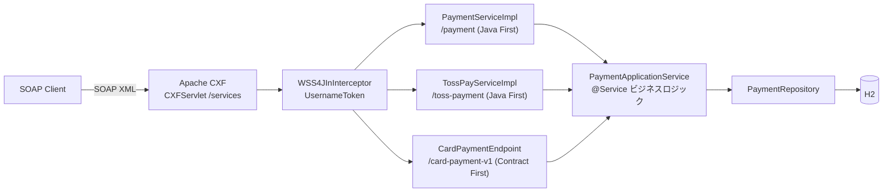

# カード決済 SOAP インターフェース

[English](README.md) | [한국어](README.ko.md) | [简体中文](README.zh-CN.md) | **日本語**

> レガシー SOAP 決済システムの `@WebService` SEI + `ServiceImpl` 構造を
> **Spring Boot + Apache CXF (JAX-WS)** 上で再現した学習用 PoC

REST ではなく **SOAP 電文**でやり取りする連携で繰り返し現れる問題
— 契約(WSDL)と実装の分離、Fault ではなく結果コード、XML ↔ オブジェクトのマーシャリング —
を実際に体験し、解決してみることが目的です。

<br>

## 🎯 学習目標

- Java First 方式で **SEI が WSDL に変換される過程**を目で確認する
- `@WebService` の `targetNamespace` / `serviceName` / `endpointInterface` の役割を区別する
- **Endpoint(アダプタ)と ApplicationService(ビジネスロジック)を分離する**理由を体感する
- JAXB が XML ↔ Java オブジェクトをマーシャリングする過程をログで観察する
- 同じビジネス層の上で **Java First と Contract First を並べて比較**し、
  それぞれが契約に何を載せられるのかを確認する
- Endpoint の手前に **WS-Security(UsernameToken)** を立て、
  プロトコルエラーと業務エラーが分かれる地点を確認する

<br>

## 🚀 機能要件

### カード承認 (`approve`)

- 加盟店 ID、カード番号、金額を受け取って決済を承認する。
- 承認番号は `AP` + `yyyyMMdd` + 6 桁の乱数の形式で生成する。(例: `AP20260911712509`)
- カード番号は**マスクした形でのみ保存する。** 先頭 6 桁と末尾 4 桁以外を隠す。
  - `1234567890123456` → `123456******3456`

### カード取消 (`cancel`)

- 加盟店 ID と承認番号で取引を検索して取り消す。
- 取り消された取引は状態が `APPROVED → CANCELED` に変わり、取消時刻が記録される。

### 取引照会 (`inquiry`)

- 加盟店 ID と承認番号で取引を検索し、現在の状態を返す。
- SEI にメソッドを 1 つ増やすと WSDL がどこまで変わるのかを見るために追加した →
  [docs/wsdl-diff.md](docs/wsdl-diff.md)

### 承認の冪等性

- すべての承認リクエストは加盟店が付与した取引固有番号(`txId`)を一緒に送る。
- 同じ `(merchantId, txId)` では 2 件目の承認が生まれない。
  既存の承認をそのまま返し、`duplicated` を `true` にする。
- 事前照会だけでは同時リクエストを防げないため、`(merchant_id, tx_id)` のユニーク制約が支える。

### ヘッダー認証

- すべての Endpoint が SOAP ヘッダーに WS-Security `UsernameToken`(`PasswordText`)を要求する。
- 認証失敗は結果コードではなく **SOAP Fault** として返る。
  メッセージがビジネスコードに届く前に終わるからだ。

### 例外処理

- 以下の承認リクエストは例外が発生しなければならない。
  - 加盟店 ID が空の場合
  - カード番号が 15 桁未満の場合
  - 金額が 0 以下の場合
- 以下の取消リクエストは例外が発生しなければならない。
  - 該当する承認番号の取引が存在しない場合
  - すでに取り消された取引の場合
- 発生した例外は **SOAP Fault として投げず、結果コードに変換して**応答する。
- 想定外の例外は `9999` にまとめ、原因はサーバーログにのみ残す。

<br>

## 📄 インターフェース仕様

### Endpoint

契約を 3 つ publish し、その後ろのビジネス層は 1 つだ。

| 項目 | カード (Java First) | トス (Java First) | カード v1 (Contract First) |
|---|---|---|---|
| targetNamespace | `http://payment.poc.com/` | `http://toss.payment.poc.com/` | `http://contract.payment.poc.com/v1` |
| serviceName | `PaymentService` | `TossPayService` | `CardPaymentService` |
| portName | `PaymentServicePort` | `TossPayServicePort` | `CardPaymentPort` |
| Endpoint | `/services/payment` | `/services/toss-payment` | `/services/card-payment-v1` |
| 契約の原本 | SEI | SEI | `src/main/resources/wsdl/card-payment-v1.wsdl` |

3 つとも `http://localhost:8080` の下にあり、それぞれが `?wsdl` を提供する。

### オペレーション

**カード契約** — リクエストのパート名は `request`、レスポンスのパート名は `response` に固定する。
(`@WebParam` / `@WebResult`)

| オペレーション | リクエスト | レスポンス |
|---|---|---|
| `approve` | `merchantId`, `txId`, `cardNo`, `amount` | `resultCode`, `resultMessage`, `approvalNo`, `approvedAt`, `duplicated` |
| `cancel` | `merchantId`, `approvalNo` | `resultCode`, `resultMessage`, `approvalNo`, `canceledAt` |
| `inquiry` | `merchantId`, `approvalNo` | `resultCode`, `resultMessage`, `approvalNo`, `status`, `maskedCardNo`, `amount`, `approvedAt`, `canceledAt` |

**トス契約** — 同じ業務、違う語彙。ここでは `orderId` が冪等性キーになる。

| オペレーション | リクエスト | レスポンス |
|---|---|---|
| `pay` | `storeId`, `orderId`, `payToken`, `totalAmount` | `status`(`DONE` / `ABORTED`), `paymentKey`, `orderId`, `message`, `approvedAt`, `duplicated` |
| `cancelPay` | `storeId`, `paymentKey`, `cancelReason` | `status`(`CANCELED` / `ABORTED`), `paymentKey`, `message`, `canceledAt` |

**Contract First 契約** — Java First が文字列で返していた値に型が付き(`xs:dateTime`、
`xs:enumeration`)、スキーマ制約を XML 層で強制する。

| オペレーション | リクエスト | レスポンス |
|---|---|---|
| `approveCard` | `merchantId`, `txId`, `cardNo`, `amount` | `resultCode`, `resultMessage`, `approvalNo`, `approvedAt`, `duplicated` |
| `inquireCard` | `merchantId`, `approvalNo` | `resultCode`, `resultMessage`, `approvalNo`, `status`, `maskedCardNo`, `amount`, `approvedAt`, `canceledAt` |

### 結果コード

SOAP レスポンスは **Fault ではなく結果コードで失敗を表現する。**(レガシー電文連携の方式)

| コード | 意味 |
|---|---|
| `0000` | 成功 |
| `1001` | 承認リクエスト値エラー |
| `2001` | 取消失敗(取引なし / すでに取消済み) |
| `3001` | 照会失敗(取引なし) |
| `9999` | システムエラー |

認証だけは例外だ。`UsernameToken` が無いか誤っていれば、結果コードではなく Fault が返る。
結果コードを作る層までメッセージが届かないからだ。

```xml
<soap:Fault>
  <faultcode xmlns:ns1="http://ws.apache.org/wss4j">ns1:SecurityError</faultcode>
  <faultstring>A security error was encountered when verifying the message</faultstring>
</soap:Fault>
```

### 承認番号

```
AP20260911712509
```

| 区間 | 例 | 意味 |
|---|---|---|
| 接頭辞 | `AP` | 承認(Approval) |
| 承認日付 | `20260911` | `yyyyMMdd` |
| 連番 | `712509` | 6 桁の乱数 |

承認番号が**取消・照会リクエストのキー**の役割を果たす。`merchantId + approvalNo` で取引を検索する。

### 取引固有番号 (`txId`)

呼び出し側が付与し、検索ではなく**重複判定**のキーになる。同じ `(merchantId, txId)` で 2 回
送ると、2 回目のレスポンスに最初の承認番号がそのまま入り `duplicated` が `true` になる。
金額を再承認することも、上書きすることもない。

<br>

## 📐 プログラミング要件

- Java 17、Spring Boot 3.5.11、Apache CXF 4.1.5 を使用する。
- DB は H2(in-memory)+ Spring Data JPA を使用する。
- **`PaymentService`(SEI)は外部契約である。** このインターフェースがそのまま WSDL として
  公開されるため、内部都合でシグネチャを変えない。
- **`PaymentServiceImpl` にビジネスロジックを置かない。** DTO ↔ ドメイン変換のあと
  ApplicationService に委譲するだけにする。
- **`PaymentApplicationService` は SOAP を一切知らないこと。**
  SOAP を REST に変えてもこのクラスはそのまま再利用できなければならない。
- ドメインオブジェクトは setter を開かず、静的ファクトリメソッドと意味のあるメソッドで状態を変える。
- **契約を 1 つ増やすときにビジネスロジックを増やさない。** SEI が増えればアダプタとマッパーだけが増える。
- **Contract First のソースは生成物なのでコミットしない。** 手で書いた WSDL から
  `wsdl2java` がビルド時に生成する。
- **コミット単位は下記の機能リスト単位とする。**

<br>

## ✅ 実装する機能リスト

- [x] ドメイン `Payment` / `PaymentStatus` の定義
  - [x] `Payment.approve()` 静的ファクトリで承認状態を生成
  - [x] `Payment.cancel()` — すでに取消済みなら例外
- [x] `PaymentRepository` — 加盟店 ID + 承認番号で取引を検索
- [x] `PaymentApplicationService` のビジネスロジック
  - [x] 承認リクエスト値の検証(加盟店 ID / カード番号 / 金額)
  - [x] カード番号のマスキング
  - [x] 承認番号の生成
  - [x] 取消処理
  - [x] 照会処理(readOnly)
  - [x] 承認リクエストの冪等性 — `txId` による重複承認防止
- [x] SOAP 契約の定義
  - [x] `PaymentService` SEI (`@WebService`)
  - [x] リクエスト/レスポンス DTO (JAXB `@XmlType`)
  - [x] 照会(inquiry)オペレーション
  - [x] 2 つ目の SEI(`TossPayService`)— 独自の名前空間
  - [x] Contract First の WSDL + `wsdl2java` コード生成(`CardPaymentPortType`)
- [x] SOAP アダプタ
  - [x] `CardPaymentMapper` ドメイン ↔ DTO 変換
  - [x] 例外 → 結果コード変換
  - [x] `TossPayMapper` — 同じドメインを違う語彙に翻訳
  - [x] `ContractCardMapper` — `LocalDateTime` ↔ `xs:dateTime`、状態 ↔ スキーマ enum
- [x] `CxfConfig` — Endpoint publish + `LoggingFeature`
  - [x] マルチ Endpoint publish(カード / トス / Contract First)
  - [x] WS-Security(UsernameToken)ヘッダー認証
  - [x] Contract First Endpoint に `schema-validation-enabled` を適用
- [x] テスト(24 件)
  - [x] 統合テスト(`JaxWsProxyFactoryBean` クライアント)
  - [x] curl 呼び出しスクリプト
  - [x] `TossPaySoapIntegrationTest` — 2 つ目の契約 + 契約をまたぐ照会
  - [x] `WsSecurityIntegrationTest` — トークン無し / パスワード誤り / 未登録ユーザー
  - [x] `ContractFirstIntegrationTest` — 生成 SEI、スキーマによる拒否、publish された WSDL

<br>

## 📤 実行結果

### 承認成功

**リクエスト**

```xml
<soapenv:Envelope xmlns:soapenv="http://schemas.xmlsoap.org/soap/envelope/"
                  xmlns:pay="http://payment.poc.com/">
    <soapenv:Header>
        <wsse:Security soapenv:mustUnderstand="1"
                       xmlns:wsse="http://docs.oasis-open.org/wss/2004/01/oasis-200401-wss-wssecurity-secext-1.0.xsd">
            <wsse:UsernameToken>
                <wsse:Username>poc-client</wsse:Username>
                <wsse:Password Type="...#PasswordText">poc-secret</wsse:Password>
            </wsse:UsernameToken>
        </wsse:Security>
    </soapenv:Header>
    <soapenv:Body>
        <pay:approve>
            <request>
                <merchantId>M1001</merchantId>
                <txId>TX-20260911-0001</txId>
                <cardNo>1234567890123456</cardNo>
                <amount>10000</amount>
            </request>
        </pay:approve>
    </soapenv:Body>
</soapenv:Envelope>
```

**レスポンス**

```xml
<response>
    <resultCode>0000</resultCode>
    <resultMessage>승인 성공</resultMessage>
    <approvalNo>AP20260911712509</approvalNo>
    <approvedAt>2026-09-11 05:32:04</approvedAt>
    <duplicated>false</duplicated>
</response>
```

### 同じリクエストをもう一度 — 承認は増えない

```xml
<response>
    <resultCode>0000</resultCode>
    <resultMessage>이미 승인된 거래입니다 (기존 승인 반환)</resultMessage>
    <approvalNo>AP20260911712509</approvalNo>
    <approvedAt>2026-09-11 05:32:04</approvedAt>
    <duplicated>true</duplicated>
</response>
```

### 承認失敗 — 金額が 0 以下

```xml
<response>
    <resultCode>1001</resultCode>
    <resultMessage>금액은 0보다 커야 합니다</resultMessage>
</response>
```

### 取消成功

```xml
<response>
    <resultCode>0000</resultCode>
    <resultMessage>취소 성공</resultMessage>
    <approvalNo>AP20260911712509</approvalNo>
    <canceledAt>2026-09-11 05:32:07</canceledAt>
</response>
```

### 取消失敗 — すでに取消済みの取引

```xml
<response>
    <resultCode>2001</resultCode>
    <resultMessage>이미 취소된 거래입니다: AP20260911712509</resultMessage>
</response>
```

### 取消失敗 — 取引なし

```xml
<response>
    <resultCode>2001</resultCode>
    <resultMessage>거래를 찾을 수 없습니다: AP99999999999999</resultMessage>
</response>
```

### 照会成功

```xml
<response>
    <resultCode>0000</resultCode>
    <resultMessage>조회 성공</resultMessage>
    <approvalNo>AP20260911712509</approvalNo>
    <status>APPROVED</status>
    <maskedCardNo>123456******3456</maskedCardNo>
    <amount>10000</amount>
    <approvedAt>2026-09-11 05:32:04</approvedAt>
</response>
```

### 認証失敗 — `UsernameToken` なし

```xml
<soap:Fault>
    <faultcode xmlns:ns1="http://ws.apache.org/wss4j">ns1:SecurityError</faultcode>
    <faultstring>A security error was encountered when verifying the message</faultstring>
</soap:Fault>
```

### トス契約、同じ業務

```xml
<response>
    <status>DONE</status>
    <paymentKey>AP20260911712509</paymentKey>
    <orderId>ORDER-20260911-0001</orderId>
    <message>결제 완료</message>
    <approvedAt>2026-09-11T05:32:04</approvedAt>
    <duplicated>false</duplicated>
</response>
```

### Contract First — スキーマがリクエストを拒否する

同じマイナス金額に対して Java First Endpoint は結果コード `1001` を返す。
ここではビジネスコードが動く前に契約が拒否する。

```xml
<soap:Fault>
    <faultcode>soap:Client</faultcode>
    <faultstring>Unmarshalling Error: cvc-minExclusive-valid: Value '-100' is not facet-valid
with respect to minExclusive '0.0' for type 'Amount'.</faultstring>
</soap:Fault>
```

> 結果メッセージはドメインコードのものをそのまま出力しているため韓国語です。

<br>

## 🏗 アーキテクチャ



契約 3 つ、アダプタ 3 つ、ビジネス層 1 つです。認証は 3 つの手前に共通で立ち、
アダプタより下は SOAP の存在を知りません。

```
com.poc.payment
├── config/
│   └── CxfConfig.java               # Endpoint 3 つの publish + LoggingFeature + WSS4J インターセプタ
├── security/
│   ├── SoapSecurityProperties.java  # soap.security.* のアカウント
│   └── UsernameTokenCallbackHandler.java
├── webservice/card/                 # Java First 契約(外部契約)
│   ├── PaymentService.java          # SEI (@WebService) — そのまま WSDL になる
│   ├── PaymentServiceImpl.java      # Endpoint 実装、例外 → 結果コード変換
│   ├── dto/                         # SOAP メッセージ契約 (JAXB @XmlType)
│   └── mapper/                      # CardPaymentMapper — ドメイン ↔ DTO 変換
├── webservice/toss/                 # 2 つ目の Java First 契約、独自の名前空間
│   ├── TossPayService.java          # SEI — storeId / orderId / payToken
│   ├── TossPayServiceImpl.java
│   ├── dto/
│   └── mapper/                      # TossPayMapper — 結果コードではなく状態文字列
├── webservice/contract/             # Contract First アダプタ
│   ├── CardPaymentEndpoint.java     # 生成された CardPaymentPortType を実装
│   └── ContractCardMapper.java      # LocalDateTime ↔ xs:dateTime、状態 ↔ スキーマ enum
├── service/                         # PaymentApplicationService、ApprovalResult (SOAP を知らない)
├── domain/                          # Payment(状態マシン)、PaymentStatus
└── repository/                      # Spring Data JPA

src/main/resources/wsdl/
└── card-payment-v1.wsdl             # 手で書いた契約 → wsdl2java → build/generated/
```

ビジネス層が SOAP を知らないため、SOAP を REST に変えても `service` 以下はそのまま再利用できます。
2 つ目・3 つ目の契約を追加する際にビジネスロジックを 1 行も書き足さなかったことが、その証拠です。

<br>

## 🛠 技術スタック

| 区分 | 使用技術 |
|---|---|
| Language | Java 17 |
| Framework | Spring Boot 3.5.11 |
| SOAP | Apache CXF 4.1.5 (`cxf-spring-boot-starter-jaxws`)、JAX-WS / JAXB |
| 永続化 | Spring Data JPA、H2 (in-memory) |
| ビルド | Gradle |
| SOAP ロギング | `cxf-rt-features-logging` (`LoggingFeature`) |
| WS-Security | `cxf-rt-ws-security` (WSS4J `UsernameToken`) |
| コード生成 | `cxf-tools-wsdlto-*` — Gradle `JavaExec` タスク (`./gradlew wsdl2java`) |

<br>

## 🏃 実行方法

```bash
# 1. アプリケーションの実行
./gradlew bootRun

# 2. WSDL の確認 — SEI が契約に変換された結果
curl http://localhost:8080/services/payment?wsdl

# 3. 承認の呼び出し(スクリプトが UsernameToken ヘッダーも送る)
./scripts/approve.sh TX-1

# 4. 同じ取引番号でもう一度 — 承認は増えない
./scripts/approve.sh TX-1
```

| 区分 | アドレス |
|---|---|
| カード Endpoint (Java First) | `http://localhost:8080/services/payment` |
| トス Endpoint (Java First) | `http://localhost:8080/services/toss-payment` |
| カード v1 Endpoint (Contract First) | `http://localhost:8080/services/card-payment-v1` |
| **WSDL** | 上記 3 つのアドレスの末尾に `?wsdl` |
| サービス一覧 | `http://localhost:8080/services` |
| H2 コンソール | `http://localhost:8080/h2-console` (JDBC URL: `jdbc:h2:mem:paymentdb`、ユーザー `sa`、パスワードなし) |

すべての Endpoint が `wsse:UsernameToken` ヘッダーを要求します
(`poc-client` / `poc-secret` — `application.yml` の `soap.security`)。
ヘッダー無しで呼ぶと Fault が返ります。

H2 コンソールで承認/取消の結果を確認できます。

```sql
SELECT * FROM payments;  -- status = APPROVED / CANCELED、masked_card_no を確認
```

### テスト

```bash
./gradlew test
```

- `PaymentSoapIntegrationTest` — `JaxWsProxyFactoryBean` の Java SOAP クライアントで
  承認 / 取消 / 照会 / 冪等性を検証
- `TossPaySoapIntegrationTest` — 2 つ目の契約。トス契約で承認した取引をカード契約で
  照会するクロス検証を含む
- `WsSecurityIntegrationTest` — トークン無し / パスワード誤り / 未登録ユーザー
- `ContractFirstIntegrationTest` — 生成された SEI、スキーマによる拒否、publish された WSDL

curl で SOAP 電文を直接送ることもできます。

```bash
./scripts/approve.sh TX-1                 # 承認(同じ txId で 2 回 → duplicated=true)
./scripts/cancel.sh AP20260911712509      # 取消(承認レスポンスの approvalNo を使用)
./scripts/inquiry.sh AP20260911712509     # 照会
./scripts/toss-pay.sh ORDER-1             # トス契約
./scripts/contract-approve.sh TX-2        # Contract First Endpoint
./scripts/contract-approve.sh TX-3 -100   # スキーマ違反はこう見える
```

コード生成はビルドに組み込まれていますが、単独でも実行できます。

```bash
./gradlew wsdl2java   # src/main/resources/wsdl/card-payment-v1.wsdl → build/generated/wsdl2java
```

**SoapUI** — WSDL URL をインポートするとリクエストテンプレートが自動生成されます。

> コンソールに `LoggingFeature` が SOAP リクエスト/レスポンスの XML をそのまま出力するため、
> JAXB のマーシャリング過程を目で確認できます。

<br>

## 🤔 設計で悩んだ点

| テーマ | 選択 | 理由 |
|---|---|---|
| WSDL 生成 | Java First (`@WebService` SEI) | SEI がそのまま契約になる過程を目で確認するために選んだ |
| 失敗の表現 | Fault ではなく結果コード | レガシー電文連携の慣例。クライアントが例外スタックではなくコードで分岐する |
| 層の分離 | Endpoint(アダプタ)/ ApplicationService(ビジネス) | SOAP を REST に変えてもビジネスロジックをそのまま再利用できる |
| メッセージ契約 | ドメインではなく別の JAXB DTO | ドメインのフィールドが変わっても外部契約(WSDL)が壊れない |
| 例外マッピング | ビジネスは例外を投げ、アダプタがコードに翻訳 | ビジネス層が電文コード体系を知らなくてよい |
| カード番号 | マスクした値のみ保存 | 原本を保管しない。マスキングの責任はビジネス層に置く |
| ドメインの状態変更 | 静的ファクトリ + `cancel()` | setter を開かない。「すでに取消済み」の防御はドメインが担う |
| 冪等性キー | 呼び出し側が渡す `txId`、`(merchantId, txId)` でユニーク | 再送するのは呼び出し側なので、キーも呼び出し側が握る。事前照会が答え、制約が保証する |
| 重複承認 | 既存の承認を `duplicated = true` でそのまま返す | 再送はエラーではない。エラーは再承認や金額の上書きのほうだ |
| 認証の置き場所 | ビジネスではなく WSS4J インターセプタ | ビジネス層がアカウントを知らず、アンマーシャリング前に検証が終わる |
| 認証失敗の表現 | 他の失敗と違い SOAP Fault | 結果コードを作る層にメッセージが届かない。`9999` で包むとプロトコルエラーを業務エラーに偽装することになる |
| 契約が複数 | 契約ごとに SEI 1 つ、SEI ごとに名前空間 1 つ | カード契約に触れずに `TossPayService` 固有の語彙を与えられた |
| Contract First の併存 | 両方 publish、ビジネス層は共有 | 比較そのものが目的 → [docs/contract-first.md](docs/contract-first.md) |
| 生成ソース | `build/` に生成しコミットしない | WSDL を直すことが Java を変える唯一の経路でなければ、依存の向きが成立しない |

<br>

## ⚠️ 既知の簡略化

PoC の範囲として意図的に残した部分です。実運用の前に必ず解消する必要があります。

- **HTTPS がない** — `UsernameToken` は入れましたが、平文 HTTP 上の `PasswordText` はパスワードをそのまま流します。実運用には TLS が必要で、平文パスワードより Digest や署名が望ましいです。
- **アカウントが `application.yml` に 1 組だけ** — 平文で、すべての呼び出し側が同じアカウントを使います。実運用ではクライアント別のアカウントをストアに置いてローテーションします。
- **`LoggingFeature` がリクエスト XML 全体を出力** — マーシャリング観察用です。カード番号の平文に*パスワードまで*ログに残るため、本番で有効にはできません。
- **セキュリティ要件が契約に現れない** — インターセプタにしかないため `?wsdl` には出てきません。消費者に伝えるには WS-SecurityPolicy を publish する必要があります。
- **`cxf-rt-ws-security` から `opensaml` を除外** — `UsernameToken` だけを使い、該当アーティファクトは Maven Central にありません。SAML 系トークンを使うなら Shibboleth リポジトリを戻す必要があります。
- **同時の重複リクエストはマージではなく拒否** — 同じ `txId` が同時に来ると承認は 1 件だけ残りますが、負けた側はユニーク制約違反で `9999` を受け取ります。少し後に再送すれば元の承認が返ります。
- **承認番号が 6 桁の乱数** — 同じ日に衝突すると unique 制約に引っかかり `9999` になります。実運用ではシーケンス/採番サーバーを使います。
- **Contract First は一部しか覆っていない** — `card-payment-v1.wsdl` には承認と照会だけがあり、取消はありません。主契約は依然 Java First 側です。
- **`xs:dateTime` を手で変換している** — `ContractCardMapper` が毎回 `LocalDateTime` を `XMLGregorianCalendar` に変換します。本来は JAXB バインディングファイル + `XmlAdapter` です。
- **H2 in-memory** — 再起動すると取引データが消えます。

<br>

## 🗺 今後実装するもの

完了:

- [x] 照会(inquiry)オペレーションの追加 → WSDL の diff を観察 → [docs/wsdl-diff.md](docs/wsdl-diff.md)
- [x] `wsdl2java` で **Contract First** 版を作り Java First と比較 → [docs/contract-first.md](docs/contract-first.md)
- [x] WSS4J で SOAP ヘッダー認証(UsernameToken)を追加
- [x] 2 つ目の SEI(`TossPayService`)を追加してマルチ Endpoint 構成
- [x] 承認リクエストの冪等性(取引固有番号による重複承認防止)

次 — 上の「既知の簡略化」で痛い順に:

- [ ] HTTPS の適用、`PasswordText` ではなく Digest か署名
- [ ] セキュリティ要件を WS-SecurityPolicy として publish し WSDL に載せる
- [ ] クライアント別のアカウントを `application.yml` の外へ
- [ ] `LoggingFeature` を切るのではなく、カード番号とパスワードだけをマスクして出力
- [ ] 同時重複リクエストで負けた側にも `9999` ではなく元の承認を返す
- [ ] 6 桁の乱数ではなく採番サーバーで承認番号を生成
- [ ] JAXB バインディングファイルで `xs:dateTime` を `LocalDateTime` に直接マッピング
