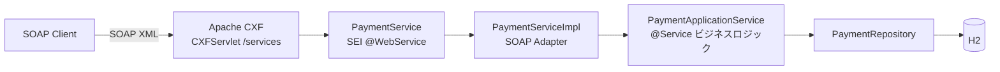

# カード決済 SOAP インターフェース

[English](README.md) | [한국어](README.ko.md) | [简体中文](README.zh-CN.md) | **日本語**

> レガシー SOAP 決済システムの `@WebService` SEI + `ServiceImpl` 構造を
> **Spring Boot + Apache CXF (JAX-WS)** 上で再現した学習用 PoC

REST ではなく **SOAP 電文**でやり取りする連携で繰り返し現れる問題
— 契約(WSDL)と実装の分離、Fault ではなく結果コード、XML ↔ オブジェクトのマーシャリング —
を実際に体験し、解決してみることが目的です。

<br>

## 🎯 学習目標

- Java First 方式で **SEI が WSDL に変換される過程**を目で確認する
- `@WebService` の `targetNamespace` / `serviceName` / `endpointInterface` の役割を区別する
- **Endpoint(アダプタ)と ApplicationService(ビジネスロジック)を分離する**理由を体感する
- JAXB が XML ↔ Java オブジェクトをマーシャリングする過程をログで観察する

<br>

## 🚀 機能要件

### カード承認 (`approve`)

- 加盟店 ID、カード番号、金額を受け取って決済を承認する。
- 承認番号は `AP` + `yyyyMMdd` + 6 桁の乱数の形式で生成する。(例: `AP20260911712509`)
- カード番号は**マスクした形でのみ保存する。** 先頭 6 桁と末尾 4 桁以外を隠す。
  - `1234567890123456` → `123456******3456`

### カード取消 (`cancel`)

- 加盟店 ID と承認番号で取引を検索して取り消す。
- 取り消された取引は状態が `APPROVED → CANCELED` に変わり、取消時刻が記録される。

### 例外処理

- 以下の承認リクエストは例外が発生しなければならない。
  - 加盟店 ID が空の場合
  - カード番号が 15 桁未満の場合
  - 金額が 0 以下の場合
- 以下の取消リクエストは例外が発生しなければならない。
  - 該当する承認番号の取引が存在しない場合
  - すでに取り消された取引の場合
- 発生した例外は **SOAP Fault として投げず、結果コードに変換して**応答する。
- 想定外の例外は `9999` にまとめ、原因はサーバーログにのみ残す。

<br>

## 📄 インターフェース仕様

### Endpoint

| 項目 | 値 |
|---|---|
| targetNamespace | `http://payment.poc.com/` |
| serviceName | `PaymentService` |
| portName | `PaymentServicePort` |
| Endpoint | `http://localhost:8080/services/payment` |
| WSDL | `http://localhost:8080/services/payment?wsdl` |

### オペレーション

| オペレーション | リクエスト | レスポンス |
|---|---|---|
| `approve` | `merchantId`, `cardNo`, `amount` | `resultCode`, `resultMessage`, `approvalNo`, `approvedAt` |
| `cancel` | `merchantId`, `approvalNo` | `resultCode`, `resultMessage`, `approvalNo`, `canceledAt` |

リクエストのパート名は `request`、レスポンスのパート名は `response` に固定する。(`@WebParam` / `@WebResult`)

### 結果コード

SOAP レスポンスは **Fault ではなく結果コードで失敗を表現する。**(レガシー電文連携の方式)

| コード | 意味 |
|---|---|
| `0000` | 成功 |
| `1001` | 承認リクエスト値エラー |
| `2001` | 取消失敗(取引なし / すでに取消済み) |
| `9999` | システムエラー |

### 承認番号

```
AP20260911712509
```

| 区間 | 例 | 意味 |
|---|---|---|
| 接頭辞 | `AP` | 承認(Approval) |
| 承認日付 | `20260911` | `yyyyMMdd` |
| 連番 | `712509` | 6 桁の乱数 |

承認番号が**取消リクエストのキー**の役割を果たす。`merchantId + approvalNo` で取引を検索する。

<br>

## 📐 プログラミング要件

- Java 17、Spring Boot 3.5.11、Apache CXF 4.1.5 を使用する。
- DB は H2(in-memory)+ Spring Data JPA を使用する。
- **`PaymentService`(SEI)は外部契約である。** このインターフェースがそのまま WSDL として
  公開されるため、内部都合でシグネチャを変えない。
- **`PaymentServiceImpl` にビジネスロジックを置かない。** DTO ↔ ドメイン変換のあと
  ApplicationService に委譲するだけにする。
- **`PaymentApplicationService` は SOAP を一切知らないこと。**
  SOAP を REST に変えてもこのクラスはそのまま再利用できなければならない。
- ドメインオブジェクトは setter を開かず、静的ファクトリメソッドと意味のあるメソッドで状態を変える。
- **コミット単位は下記の機能リスト単位とする。**

<br>

## ✅ 実装する機能リスト

- [x] ドメイン `Payment` / `PaymentStatus` の定義
  - [x] `Payment.approve()` 静的ファクトリで承認状態を生成
  - [x] `Payment.cancel()` — すでに取消済みなら例外
- [x] `PaymentRepository` — 加盟店 ID + 承認番号で取引を検索
- [x] `PaymentApplicationService` のビジネスロジック
  - [x] 承認リクエスト値の検証(加盟店 ID / カード番号 / 金額)
  - [x] カード番号のマスキング
  - [x] 承認番号の生成
  - [x] 取消処理
  - [ ] 承認リクエストの冪等性(同一リクエストの重複承認防止)
- [x] SOAP 契約の定義
  - [x] `PaymentService` SEI (`@WebService`)
  - [x] リクエスト/レスポンス DTO (JAXB `@XmlType`)
  - [ ] 照会(inquiry)オペレーション
- [x] `PaymentServiceImpl` SOAP アダプタ
  - [x] `CardPaymentMapper` ドメイン ↔ DTO 変換
  - [x] 例外 → 結果コード変換
- [x] `CxfConfig` — Endpoint publish + `LoggingFeature`
  - [ ] WS-Security(UsernameToken)ヘッダー認証
- [x] テスト
  - [x] 統合テスト(`JaxWsProxyFactoryBean` クライアント)
  - [x] curl 呼び出しスクリプト

<br>

## 📤 実行結果

### 承認成功

**リクエスト**

```xml
<soapenv:Envelope xmlns:soapenv="http://schemas.xmlsoap.org/soap/envelope/"
                  xmlns:pay="http://payment.poc.com/">
    <soapenv:Body>
        <pay:approve>
            <request>
                <merchantId>M1001</merchantId>
                <cardNo>1234567890123456</cardNo>
                <amount>10000</amount>
            </request>
        </pay:approve>
    </soapenv:Body>
</soapenv:Envelope>
```

**レスポンス**

```xml
<response>
    <resultCode>0000</resultCode>
    <resultMessage>승인 성공</resultMessage>
    <approvalNo>AP20260911712509</approvalNo>
    <approvedAt>2026-09-11 05:32:04</approvedAt>
</response>
```

### 承認失敗 — 金額が 0 以下

```xml
<response>
    <resultCode>1001</resultCode>
    <resultMessage>금액은 0보다 커야 합니다</resultMessage>
</response>
```

### 取消成功

```xml
<response>
    <resultCode>0000</resultCode>
    <resultMessage>취소 성공</resultMessage>
    <approvalNo>AP20260911712509</approvalNo>
    <canceledAt>2026-09-11 05:32:07</canceledAt>
</response>
```

### 取消失敗 — すでに取消済みの取引

```xml
<response>
    <resultCode>2001</resultCode>
    <resultMessage>이미 취소된 거래입니다: AP20260911712509</resultMessage>
</response>
```

### 取消失敗 — 取引なし

```xml
<response>
    <resultCode>2001</resultCode>
    <resultMessage>거래를 찾을 수 없습니다: AP99999999999999</resultMessage>
</response>
```

> 結果メッセージはドメインコードのものをそのまま出力しているため韓国語です。

<br>

## 🏗 アーキテクチャ



SOAP 契約(アダプタ)とビジネスロジックを分離した構造です。

```
com.poc.payment
├── config/
│   └── CxfConfig.java               # Endpoint publish("/payment") + LoggingFeature
├── webservice/card/                 # SOAP アダプタ層(外部契約)
│   ├── PaymentService.java          # SEI (@WebService) — そのまま WSDL になる
│   ├── PaymentServiceImpl.java      # Endpoint 実装、例外 → 結果コード変換
│   ├── dto/                         # SOAP メッセージ契約 (JAXB @XmlType)
│   └── mapper/                      # CardPaymentMapper — ドメイン ↔ DTO 変換
├── service/                         # PaymentApplicationService (SOAP を知らない層)
├── domain/                          # Payment(状態マシン)、PaymentStatus
└── repository/                      # Spring Data JPA
```

ビジネス層が SOAP を知らないため、SOAP を REST に変えても `service` 以下はそのまま再利用できます。

<br>

## 🛠 技術スタック

| 区分 | 使用技術 |
|---|---|
| Language | Java 17 |
| Framework | Spring Boot 3.5.11 |
| SOAP | Apache CXF 4.1.5 (`cxf-spring-boot-starter-jaxws`)、JAX-WS / JAXB |
| 永続化 | Spring Data JPA、H2 (in-memory) |
| ビルド | Gradle |
| SOAP ロギング | `cxf-rt-features-logging` (`LoggingFeature`) |

<br>

## 🏃 実行方法

```bash
# 1. アプリケーションの実行
./gradlew bootRun

# 2. WSDL の確認 — SEI が契約に変換された結果
curl http://localhost:8080/services/payment?wsdl

# 3. 承認の呼び出し
./scripts/approve.sh
```

| 区分 | アドレス |
|---|---|
| SOAP Endpoint | `http://localhost:8080/services/payment` |
| **WSDL** | `http://localhost:8080/services/payment?wsdl` |
| H2 コンソール | `http://localhost:8080/h2-console` (JDBC URL: `jdbc:h2:mem:paymentdb`、ユーザー `sa`、パスワードなし) |

H2 コンソールで承認/取消の結果を確認できます。

```sql
SELECT * FROM payments;  -- status = APPROVED / CANCELED、masked_card_no を確認
```

### テスト

```bash
./gradlew test
```

- `PaymentSoapIntegrationTest` — `JaxWsProxyFactoryBean` の Java SOAP クライアントで
  承認/取消シナリオを検証

curl で SOAP 電文を直接送ることもできます。

```bash
./scripts/approve.sh                      # 承認
./scripts/cancel.sh AP20260911712509      # 取消(承認レスポンスの approvalNo を使用)
```

**SoapUI** — WSDL URL をインポートするとリクエストテンプレートが自動生成されます。

> コンソールに `LoggingFeature` が SOAP リクエスト/レスポンスの XML をそのまま出力するため、
> JAXB のマーシャリング過程を目で確認できます。

<br>

## 🤔 設計で悩んだ点

| テーマ | 選択 | 理由 |
|---|---|---|
| WSDL 生成 | Java First (`@WebService` SEI) | SEI がそのまま契約になる過程を目で確認するために選んだ |
| 失敗の表現 | Fault ではなく結果コード | レガシー電文連携の慣例。クライアントが例外スタックではなくコードで分岐する |
| 層の分離 | Endpoint(アダプタ)/ ApplicationService(ビジネス) | SOAP を REST に変えてもビジネスロジックをそのまま再利用できる |
| メッセージ契約 | ドメインではなく別の JAXB DTO | ドメインのフィールドが変わっても外部契約(WSDL)が壊れない |
| 例外マッピング | ビジネスは例外を投げ、アダプタがコードに翻訳 | ビジネス層が電文コード体系を知らなくてよい |
| カード番号 | マスクした値のみ保存 | 原本を保管しない。マスキングの責任はビジネス層に置く |
| ドメインの状態変更 | 静的ファクトリ + `cancel()` | setter を開かない。「すでに取消済み」の防御はドメインが担う |

<br>

## ⚠️ 既知の簡略化

PoC の範囲として意図的に残した部分です。実運用の前に必ず解消する必要があります。

- **認証・暗号化がない** — WS-Security(UsernameToken)も HTTPS も適用していません。実際の対外連携では両方必須です。
- **`LoggingFeature` がリクエスト XML 全体を出力** — マーシャリング観察用です。カード番号の平文がそのままログに残るため、本番で有効にはできません。
- **承認リクエストに冪等性がない** — 同じリクエストを 2 回送ると承認が 2 件作られます。実運用では取引固有番号による重複チェックが必要です。
- **承認番号が 6 桁の乱数** — 同じ日に衝突すると unique 制約に引っかかり `9999` になります。実運用ではシーケンス/採番サーバーを使います。
- **Java First** — SEI を直すと WSDL がすぐに変わります。外部契約が先に決まる対外連携では Contract First が安全です。
- **H2 in-memory** — 再起動すると取引データが消えます。

<br>

## 🗺 今後実装するもの

- [ ] 照会(inquiry)オペレーションの追加 → WSDL の diff を観察
- [ ] `wsdl2java` で **Contract First** 版を作り Java First と比較
- [ ] WSS4J で SOAP ヘッダー認証(UsernameToken)を追加
- [ ] 2 つ目の SEI(例: `TossPayService`)を追加してマルチ Endpoint 構成
- [ ] 承認リクエストの冪等性(取引固有番号による重複承認防止)
