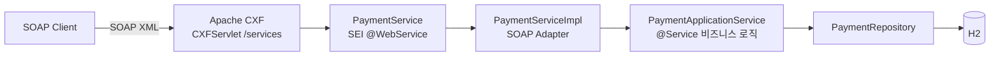

# 카드 결제 SOAP 인터페이스

[English](README.md) | **한국어** | [简体中文](README.zh-CN.md) | [日本語](README.ja.md)

> 레거시 SOAP 결제 시스템의 `@WebService` SEI + `ServiceImpl` 구조를
> **Spring Boot + Apache CXF(JAX-WS)** 위에서 재현한 학습용 PoC

실시간 REST가 아니라 **SOAP 전문**으로 주고받는 연동에서 반복적으로 등장하는 문제
— 계약(WSDL)과 구현의 분리, Fault 대신 결과 코드, XML ↔ 객체 마샬링 — 를
직접 겪어보고 해결해보는 것이 목표다.

<br>

## 🎯 학습 목표

- Java First 방식에서 **SEI가 WSDL로 변환되는 과정**을 눈으로 확인한다
- `@WebService`의 `targetNamespace` / `serviceName` / `endpointInterface` 역할을 구분한다
- **Endpoint(어댑터)와 ApplicationService(비즈니스)를 분리**하는 이유를 체감한다
- JAXB가 XML ↔ Java 객체를 마샬링하는 과정을 로그로 관찰한다

<br>

## 🚀 기능 요구사항

### 카드 승인 (`approve`)

- 가맹점 ID, 카드번호, 금액을 받아 결제를 승인한다.
- 승인번호는 `AP` + `yyyyMMdd` + 6자리 난수 형식으로 생성한다. (예: `AP20260911712509`)
- 카드번호는 **마스킹해서만 저장한다.** 앞 6자리와 뒤 4자리를 제외한 나머지를 가린다.
  - `1234567890123456` → `123456******3456`

### 카드 취소 (`cancel`)

- 가맹점 ID와 승인번호로 거래를 찾아 취소한다.
- 취소된 거래는 상태가 `APPROVED → CANCELED`로 바뀌고 취소 시각이 기록된다.

### 예외 처리

- 아래 승인 요청은 예외가 발생해야 한다.
  - 가맹점 ID가 비어 있는 경우
  - 카드번호가 15자리 미만인 경우
  - 금액이 0 이하인 경우
- 아래 취소 요청은 예외가 발생해야 한다.
  - 해당 승인번호의 거래가 없는 경우
  - 이미 취소된 거래인 경우
- 발생한 예외는 **SOAP Fault로 던지지 않고 결과 코드로 변환**해 응답한다.
- 예상하지 못한 예외는 `9999`로 묶고, 원인은 서버 로그에만 남긴다.

<br>

## 📄 인터페이스 규격

### Endpoint

| 구분 | 값 |
|---|---|
| targetNamespace | `http://payment.poc.com/` |
| serviceName | `PaymentService` |
| portName | `PaymentServicePort` |
| Endpoint | `http://localhost:8080/services/payment` |
| WSDL | `http://localhost:8080/services/payment?wsdl` |

### 오퍼레이션

| 오퍼레이션 | 요청 | 응답 |
|---|---|---|
| `approve` | `merchantId`, `cardNo`, `amount` | `resultCode`, `resultMessage`, `approvalNo`, `approvedAt` |
| `cancel` | `merchantId`, `approvalNo` | `resultCode`, `resultMessage`, `approvalNo`, `canceledAt` |

요청 파트명은 `request`, 응답 파트명은 `response`로 고정한다. (`@WebParam` / `@WebResult`)

### 결과 코드

SOAP 응답은 **Fault 대신 결과 코드로 실패를 표현한다.** (레거시 전문 연동 방식)

| 코드 | 의미 |
|---|---|
| `0000` | 성공 |
| `1001` | 승인 요청값 오류 |
| `2001` | 취소 실패 (거래 없음 / 이미 취소됨) |
| `9999` | 시스템 오류 |

### 승인번호

```
AP20260911712509
```

| 구간 | 예시 | 의미 |
|---|---|---|
| 접두사 | `AP` | 승인(Approval) |
| 승인일자 | `20260911` | `yyyyMMdd` |
| 일련번호 | `712509` | 6자리 난수 |

승인번호가 **취소 요청의 키** 역할을 한다. `merchantId + approvalNo`로 거래를 찾는다.

<br>

## 📐 프로그래밍 요구사항

- Java 17, Spring Boot 3.5.11, Apache CXF 4.1.5 를 사용한다.
- DB는 H2(in-memory) + Spring Data JPA 를 사용한다.
- **`PaymentService`(SEI)는 외부 계약이다.** 이 인터페이스가 그대로 WSDL로 노출되므로
  내부 사정으로 시그니처를 바꾸지 않는다.
- **`PaymentServiceImpl`에는 비즈니스 로직을 두지 않는다.** DTO ↔ 도메인 변환 후
  ApplicationService에 위임만 한다.
- **`PaymentApplicationService`는 SOAP를 전혀 몰라야 한다.**
  SOAP를 REST로 바꿔도 이 클래스는 그대로 재사용 가능해야 한다.
- 도메인 객체는 setter를 열지 않고, 정적 팩토리 메서드와 의미 있는 메서드로 상태를 바꾼다.
- **커밋 단위는 아래 기능 목록 단위로 한다.**

<br>

## ✅ 구현할 기능 목록

- [x] 도메인 `Payment` / `PaymentStatus` 정의
  - [x] `Payment.approve()` 정적 팩토리로 승인 상태 생성
  - [x] `Payment.cancel()` — 이미 취소된 거래면 예외
- [x] `PaymentRepository` — 가맹점 ID + 승인번호로 거래 조회
- [x] `PaymentApplicationService` 비즈니스 로직
  - [x] 승인 요청값 검증 (가맹점 ID / 카드번호 / 금액)
  - [x] 카드번호 마스킹
  - [x] 승인번호 생성
  - [x] 취소 처리
  - [ ] 승인 요청 멱등성 처리 (동일 요청 중복 승인 방지)
- [x] SOAP 계약 정의
  - [x] `PaymentService` SEI (`@WebService`)
  - [x] 요청/응답 DTO (JAXB `@XmlType`)
  - [ ] 조회(inquiry) 오퍼레이션
- [x] `PaymentServiceImpl` SOAP 어댑터
  - [x] `CardPaymentMapper` 도메인 ↔ DTO 변환
  - [x] 예외 → 결과 코드 변환
- [x] `CxfConfig` — Endpoint publish + `LoggingFeature`
  - [ ] WS-Security(UsernameToken) 헤더 인증
- [x] 테스트
  - [x] 통합 테스트 (`JaxWsProxyFactoryBean` 클라이언트)
  - [x] curl 호출 스크립트

<br>

## 📤 실행 결과

### 승인 성공

**요청**

```xml
<soapenv:Envelope xmlns:soapenv="http://schemas.xmlsoap.org/soap/envelope/"
                  xmlns:pay="http://payment.poc.com/">
    <soapenv:Body>
        <pay:approve>
            <request>
                <merchantId>M1001</merchantId>
                <cardNo>1234567890123456</cardNo>
                <amount>10000</amount>
            </request>
        </pay:approve>
    </soapenv:Body>
</soapenv:Envelope>
```

**응답**

```xml
<response>
    <resultCode>0000</resultCode>
    <resultMessage>승인 성공</resultMessage>
    <approvalNo>AP20260911712509</approvalNo>
    <approvedAt>2026-09-11 05:32:04</approvedAt>
</response>
```

### 승인 실패 — 금액이 0 이하

```xml
<response>
    <resultCode>1001</resultCode>
    <resultMessage>금액은 0보다 커야 합니다</resultMessage>
</response>
```

### 취소 성공

```xml
<response>
    <resultCode>0000</resultCode>
    <resultMessage>취소 성공</resultMessage>
    <approvalNo>AP20260911712509</approvalNo>
    <canceledAt>2026-09-11 05:32:07</canceledAt>
</response>
```

### 취소 실패 — 이미 취소된 거래

```xml
<response>
    <resultCode>2001</resultCode>
    <resultMessage>이미 취소된 거래입니다: AP20260911712509</resultMessage>
</response>
```

### 취소 실패 — 거래 없음

```xml
<response>
    <resultCode>2001</resultCode>
    <resultMessage>거래를 찾을 수 없습니다: AP99999999999999</resultMessage>
</response>
```

<br>

## 🏗 아키텍처



SOAP 계약(어댑터)과 비즈니스 로직을 분리한 구조다.

```
com.poc.payment
├── config/
│   └── CxfConfig.java               # Endpoint publish("/payment") + LoggingFeature
├── webservice/card/                 # SOAP 어댑터 계층 (외부 계약)
│   ├── PaymentService.java          # SEI (@WebService) — 그대로 WSDL이 된다
│   ├── PaymentServiceImpl.java      # Endpoint 구현체, 예외 → 결과 코드 변환
│   ├── dto/                         # SOAP 메시지 계약 (JAXB @XmlType)
│   └── mapper/                      # CardPaymentMapper — 도메인 ↔ DTO 변환
├── service/                         # PaymentApplicationService (SOAP를 모르는 계층)
├── domain/                          # Payment(상태 머신), PaymentStatus
└── repository/                      # Spring Data JPA
```

비즈니스 계층이 SOAP를 모르므로 SOAP를 REST로 바꿔도 `service` 이하는 그대로 재사용할 수 있다.

<br>

## 🛠 기술 스택

| 구분 | 사용 기술 |
|---|---|
| Language | Java 17 |
| Framework | Spring Boot 3.5.11 |
| SOAP | Apache CXF 4.1.5 (`cxf-spring-boot-starter-jaxws`), JAX-WS / JAXB |
| 영속성 | Spring Data JPA, H2 (in-memory) |
| 빌드 | Gradle |
| SOAP 로깅 | `cxf-rt-features-logging` (`LoggingFeature`) |

<br>

## 🏃 실행 방법

```bash
# 1. 애플리케이션 실행
./gradlew bootRun

# 2. WSDL 확인 — SEI가 계약으로 변환된 결과
curl http://localhost:8080/services/payment?wsdl

# 3. 승인 호출
./scripts/approve.sh
```

| 구분 | 주소 |
|---|---|
| SOAP Endpoint | `http://localhost:8080/services/payment` |
| **WSDL** | `http://localhost:8080/services/payment?wsdl` |
| H2 콘솔 | `http://localhost:8080/h2-console` (JDBC URL: `jdbc:h2:mem:paymentdb`, 사용자 `sa`, 비밀번호 없음) |

H2 콘솔에서 승인/취소 결과를 확인할 수 있다.

```sql
SELECT * FROM payments;  -- status = APPROVED / CANCELED, masked_card_no 확인
```

### 테스트

```bash
./gradlew test
```

- `PaymentSoapIntegrationTest` — `JaxWsProxyFactoryBean` 자바 SOAP 클라이언트로 승인/취소 시나리오 검증

curl로 SOAP 전문을 직접 쏴볼 수도 있다.

```bash
./scripts/approve.sh                      # 승인
./scripts/cancel.sh AP20260911712509      # 취소 (승인 응답의 approvalNo 사용)
```

**SoapUI** — WSDL URL을 임포트하면 요청 템플릿이 자동 생성된다.

> 콘솔에 `LoggingFeature`가 SOAP 요청/응답 XML을 그대로 출력하므로
> JAXB 마샬링 과정을 눈으로 확인할 수 있다.

<br>

## 🤔 설계하며 고민한 점

| 주제 | 선택 | 이유 |
|---|---|---|
| WSDL 생성 | Java First (`@WebService` SEI) | SEI가 그대로 계약이 되는 과정을 눈으로 확인하려고 선택했다 |
| 실패 표현 | Fault 대신 결과 코드 | 레거시 전문 연동 관례. 클라이언트가 예외 스택 대신 코드로 분기한다 |
| 계층 분리 | Endpoint(어댑터) / ApplicationService(비즈니스) | SOAP를 REST로 바꿔도 비즈니스 로직을 그대로 재사용할 수 있다 |
| 메시지 계약 | 도메인이 아닌 별도 JAXB DTO | 도메인 필드가 바뀌어도 외부 계약(WSDL)이 깨지지 않는다 |
| 예외 매핑 | 비즈니스는 예외를 던지고, 어댑터가 코드로 번역 | 비즈니스 계층이 전문 코드 체계를 몰라도 된다 |
| 카드번호 | 마스킹한 값만 저장 | 원본을 보관하지 않는다. 마스킹 책임은 비즈니스 계층에 둔다 |
| 도메인 상태 변경 | 정적 팩토리 + `cancel()` | setter를 열지 않는다. "이미 취소됨" 방어를 도메인이 책임진다 |

<br>

## ⚠️ 알려진 단순화

PoC 범위로 의도적으로 남겨둔 부분이다. 실전 적용 전에 반드시 해소해야 한다.

- **인증·암호화가 없다** — WS-Security(UsernameToken)도 HTTPS도 적용하지 않았다. 실전 대외계는 둘 다 필수다.
- **`LoggingFeature`가 요청 XML 전체를 출력** — 마샬링 관찰용이다. 카드번호 평문이 그대로 로그에 남으므로 운영에 켜둘 수 없다.
- **승인 요청에 멱등성이 없다** — 같은 요청을 두 번 보내면 승인이 두 건 생긴다. 실전은 거래고유번호 기반 중복 체크가 필요하다.
- **승인번호가 6자리 난수** — 같은 날 충돌하면 unique 제약에 걸려 `9999`로 떨어진다. 실전은 시퀀스/채번 서버를 쓴다.
- **Java First** — SEI를 고치면 WSDL이 곧바로 바뀐다. 외부 계약이 먼저 정해지는 대외계에서는 Contract First가 안전하다.
- **H2 in-memory** — 재기동하면 거래 데이터가 사라진다.

<br>

## 🗺 앞으로 구현할 것

- [ ] 조회(inquiry) 오퍼레이션 추가 → WSDL diff 관찰
- [ ] `wsdl2java`로 **Contract First** 버전을 만들어 Java First와 비교
- [ ] WSS4J로 SOAP 헤더 인증(UsernameToken) 추가
- [ ] 두 번째 SEI(예: `TossPayService`) 추가해 멀티 Endpoint 구성
- [ ] 승인 요청 멱등성 (거래고유번호 기반 중복 승인 방지)
