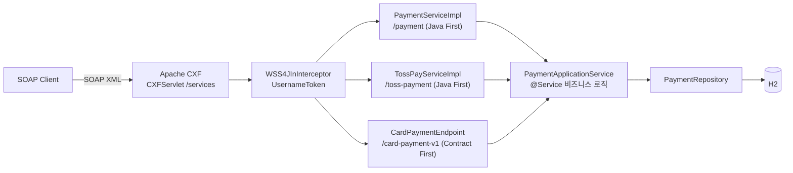

# 카드 결제 SOAP 인터페이스

[English](README.md) | **한국어** | [简体中文](README.zh-CN.md) | [日本語](README.ja.md)

> 레거시 SOAP 결제 시스템의 `@WebService` SEI + `ServiceImpl` 구조를
> **Spring Boot + Apache CXF(JAX-WS)** 위에서 재현한 학습용 PoC

실시간 REST가 아니라 **SOAP 전문**으로 주고받는 연동에서 반복적으로 등장하는 문제
— 계약(WSDL)과 구현의 분리, Fault 대신 결과 코드, XML ↔ 객체 마샬링 — 를
직접 겪어보고 해결해보는 것이 목표다.

<br>

## 🎯 학습 목표

- Java First 방식에서 **SEI가 WSDL로 변환되는 과정**을 눈으로 확인한다
- `@WebService`의 `targetNamespace` / `serviceName` / `endpointInterface` 역할을 구분한다
- **Endpoint(어댑터)와 ApplicationService(비즈니스)를 분리**하는 이유를 체감한다
- JAXB가 XML ↔ Java 객체를 마샬링하는 과정을 로그로 관찰한다
- 같은 비즈니스 계층 위에서 **Java First와 Contract First를 나란히 비교**하고,
  각 방식이 계약에 무엇까지 담을 수 있는지 확인한다
- Endpoint 앞에 **WS-Security(UsernameToken)** 를 세우고,
  프로토콜 오류와 비즈니스 오류가 갈라지는 지점을 확인한다

<br>

## 🚀 기능 요구사항

### 카드 승인 (`approve`)

- 가맹점 ID, 카드번호, 금액을 받아 결제를 승인한다.
- 승인번호는 `AP` + `yyyyMMdd` + 6자리 난수 형식으로 생성한다. (예: `AP20260911712509`)
- 카드번호는 **마스킹해서만 저장한다.** 앞 6자리와 뒤 4자리를 제외한 나머지를 가린다.
  - `1234567890123456` → `123456******3456`

### 카드 취소 (`cancel`)

- 가맹점 ID와 승인번호로 거래를 찾아 취소한다.
- 취소된 거래는 상태가 `APPROVED → CANCELED`로 바뀌고 취소 시각이 기록된다.

### 거래 조회 (`inquiry`)

- 가맹점 ID와 승인번호로 거래를 찾아 현재 상태를 돌려준다.
- SEI에 메서드 하나를 늘리면 WSDL이 어디까지 변하는지 보려고 추가했다 →
  [docs/wsdl-diff.md](docs/wsdl-diff.md)

### 승인 멱등성

- 모든 승인 요청은 가맹점이 부여한 거래고유번호(`txId`)를 함께 보낸다.
- 같은 `(merchantId, txId)`로는 두 번째 승인이 생기지 않는다.
  기존 승인을 그대로 돌려주고 `duplicated`를 `true`로 내린다.
- 사전 조회만으로는 동시 요청을 막을 수 없으므로 `(merchant_id, tx_id)` 유니크 제약이 받친다.

### 헤더 인증

- 모든 Endpoint는 SOAP 헤더에 WS-Security `UsernameToken`(`PasswordText`)을 요구한다.
- 인증 실패는 결과 코드가 아니라 **SOAP Fault**로 나간다.
  메시지가 비즈니스 코드에 닿기 전에 끝나기 때문이다.

### 예외 처리

- 아래 승인 요청은 예외가 발생해야 한다.
  - 가맹점 ID가 비어 있는 경우
  - 카드번호가 15자리 미만인 경우
  - 금액이 0 이하인 경우
- 아래 취소 요청은 예외가 발생해야 한다.
  - 해당 승인번호의 거래가 없는 경우
  - 이미 취소된 거래인 경우
- 발생한 예외는 **SOAP Fault로 던지지 않고 결과 코드로 변환**해 응답한다.
- 예상하지 못한 예외는 `9999`로 묶고, 원인은 서버 로그에만 남긴다.

<br>

## 📄 인터페이스 규격

### Endpoint

계약 3개를 publish하고, 뒤에 있는 비즈니스 계층은 하나다.

| 구분 | 카드 (Java First) | 토스 (Java First) | 카드 v1 (Contract First) |
|---|---|---|---|
| targetNamespace | `http://payment.poc.com/` | `http://toss.payment.poc.com/` | `http://contract.payment.poc.com/v1` |
| serviceName | `PaymentService` | `TossPayService` | `CardPaymentService` |
| portName | `PaymentServicePort` | `TossPayServicePort` | `CardPaymentPort` |
| Endpoint | `/services/payment` | `/services/toss-payment` | `/services/card-payment-v1` |
| 계약의 원본 | SEI | SEI | `src/main/resources/wsdl/card-payment-v1.wsdl` |

세 주소 모두 `http://localhost:8080` 아래에 있고, 각자 `?wsdl`을 제공한다.

### 오퍼레이션

**카드 계약** — 요청 파트명은 `request`, 응답 파트명은 `response`로 고정한다.
(`@WebParam` / `@WebResult`)

| 오퍼레이션 | 요청 | 응답 |
|---|---|---|
| `approve` | `merchantId`, `txId`, `cardNo`, `amount` | `resultCode`, `resultMessage`, `approvalNo`, `approvedAt`, `duplicated` |
| `cancel` | `merchantId`, `approvalNo` | `resultCode`, `resultMessage`, `approvalNo`, `canceledAt` |
| `inquiry` | `merchantId`, `approvalNo` | `resultCode`, `resultMessage`, `approvalNo`, `status`, `maskedCardNo`, `amount`, `approvedAt`, `canceledAt` |

**토스 계약** — 같은 업무, 다른 어휘. 여기서는 `orderId`가 멱등성 키다.

| 오퍼레이션 | 요청 | 응답 |
|---|---|---|
| `pay` | `storeId`, `orderId`, `payToken`, `totalAmount` | `status`(`DONE` / `ABORTED`), `paymentKey`, `orderId`, `message`, `approvedAt`, `duplicated` |
| `cancelPay` | `storeId`, `paymentKey`, `cancelReason` | `status`(`CANCELED` / `ABORTED`), `paymentKey`, `message`, `canceledAt` |

**Contract First 계약** — Java First가 문자열로 내보내던 값에 타입이 붙었고
(`xs:dateTime`, `xs:enumeration`), 스키마 제약을 XML 계층에서 강제한다.

| 오퍼레이션 | 요청 | 응답 |
|---|---|---|
| `approveCard` | `merchantId`, `txId`, `cardNo`, `amount` | `resultCode`, `resultMessage`, `approvalNo`, `approvedAt`, `duplicated` |
| `inquireCard` | `merchantId`, `approvalNo` | `resultCode`, `resultMessage`, `approvalNo`, `status`, `maskedCardNo`, `amount`, `approvedAt`, `canceledAt` |

### 결과 코드

SOAP 응답은 **Fault 대신 결과 코드로 실패를 표현한다.** (레거시 전문 연동 방식)

| 코드 | 의미 |
|---|---|
| `0000` | 성공 |
| `1001` | 승인 요청값 오류 |
| `2001` | 취소 실패 (거래 없음 / 이미 취소됨) |
| `3001` | 조회 실패 (거래 없음) |
| `9999` | 시스템 오류 |

인증만 예외다. `UsernameToken`이 없거나 틀리면 결과 코드가 아니라 Fault가 돌아온다.
결과 코드를 만드는 계층까지 메시지가 도달하지 못하기 때문이다.

```xml
<soap:Fault>
  <faultcode xmlns:ns1="http://ws.apache.org/wss4j">ns1:SecurityError</faultcode>
  <faultstring>A security error was encountered when verifying the message</faultstring>
</soap:Fault>
```

### 승인번호

```
AP20260911712509
```

| 구간 | 예시 | 의미 |
|---|---|---|
| 접두사 | `AP` | 승인(Approval) |
| 승인일자 | `20260911` | `yyyyMMdd` |
| 일련번호 | `712509` | 6자리 난수 |

승인번호가 **취소·조회 요청의 키** 역할을 한다. `merchantId + approvalNo`로 거래를 찾는다.

### 거래고유번호 (`txId`)

호출자가 부여하고, 조회가 아니라 **중복 판단**의 키다. 같은 `(merchantId, txId)`로 두 번
보내면 두 번째 응답에 첫 승인번호가 그대로 담기고 `duplicated`가 `true`가 된다.
금액을 다시 승인하지도, 덮어쓰지도 않는다.

<br>

## 📐 프로그래밍 요구사항

- Java 17, Spring Boot 3.5.11, Apache CXF 4.1.5 를 사용한다.
- DB는 H2(in-memory) + Spring Data JPA 를 사용한다.
- **`PaymentService`(SEI)는 외부 계약이다.** 이 인터페이스가 그대로 WSDL로 노출되므로
  내부 사정으로 시그니처를 바꾸지 않는다.
- **`PaymentServiceImpl`에는 비즈니스 로직을 두지 않는다.** DTO ↔ 도메인 변환 후
  ApplicationService에 위임만 한다.
- **`PaymentApplicationService`는 SOAP를 전혀 몰라야 한다.**
  SOAP를 REST로 바꿔도 이 클래스는 그대로 재사용 가능해야 한다.
- 도메인 객체는 setter를 열지 않고, 정적 팩토리 메서드와 의미 있는 메서드로 상태를 바꾼다.
- **계약을 하나 더 붙일 때 비즈니스 로직을 늘리지 않는다.** SEI가 늘면 어댑터와 매퍼만 늘어난다.
- **Contract First 소스는 생성물이므로 커밋하지 않는다.** 손으로 쓴 WSDL에서 `wsdl2java`가
  빌드 단계에 생성한다.
- **커밋 단위는 아래 기능 목록 단위로 한다.**

<br>

## ✅ 구현할 기능 목록

- [x] 도메인 `Payment` / `PaymentStatus` 정의
  - [x] `Payment.approve()` 정적 팩토리로 승인 상태 생성
  - [x] `Payment.cancel()` — 이미 취소된 거래면 예외
- [x] `PaymentRepository` — 가맹점 ID + 승인번호로 거래 조회
- [x] `PaymentApplicationService` 비즈니스 로직
  - [x] 승인 요청값 검증 (가맹점 ID / 카드번호 / 금액)
  - [x] 카드번호 마스킹
  - [x] 승인번호 생성
  - [x] 취소 처리
  - [x] 조회 처리 (readOnly)
  - [x] 승인 요청 멱등성 처리 — `txId` 기반 중복 승인 방지
- [x] SOAP 계약 정의
  - [x] `PaymentService` SEI (`@WebService`)
  - [x] 요청/응답 DTO (JAXB `@XmlType`)
  - [x] 조회(inquiry) 오퍼레이션
  - [x] 두 번째 SEI(`TossPayService`) — 별도 네임스페이스
  - [x] Contract First WSDL + `wsdl2java` 코드 생성 (`CardPaymentPortType`)
- [x] SOAP 어댑터
  - [x] `CardPaymentMapper` 도메인 ↔ DTO 변환
  - [x] 예외 → 결과 코드 변환
  - [x] `TossPayMapper` — 같은 도메인을 다른 어휘로 번역
  - [x] `ContractCardMapper` — `LocalDateTime` ↔ `xs:dateTime`, 상태 ↔ 스키마 enum
- [x] `CxfConfig` — Endpoint publish + `LoggingFeature`
  - [x] 멀티 Endpoint publish (카드 / 토스 / Contract First)
  - [x] WS-Security(UsernameToken) 헤더 인증
  - [x] Contract First Endpoint에 `schema-validation-enabled` 적용
- [x] 테스트 (24건)
  - [x] 통합 테스트 (`JaxWsProxyFactoryBean` 클라이언트)
  - [x] curl 호출 스크립트
  - [x] `TossPaySoapIntegrationTest` — 두 번째 계약 + 계약 교차 조회
  - [x] `WsSecurityIntegrationTest` — 토큰 없음 / 비밀번호 오류 / 미등록 사용자
  - [x] `ContractFirstIntegrationTest` — 생성 SEI, 스키마 거절, publish된 WSDL

<br>

## 📤 실행 결과

### 승인 성공

**요청**

```xml
<soapenv:Envelope xmlns:soapenv="http://schemas.xmlsoap.org/soap/envelope/"
                  xmlns:pay="http://payment.poc.com/">
    <soapenv:Header>
        <wsse:Security soapenv:mustUnderstand="1"
                       xmlns:wsse="http://docs.oasis-open.org/wss/2004/01/oasis-200401-wss-wssecurity-secext-1.0.xsd">
            <wsse:UsernameToken>
                <wsse:Username>poc-client</wsse:Username>
                <wsse:Password Type="...#PasswordText">poc-secret</wsse:Password>
            </wsse:UsernameToken>
        </wsse:Security>
    </soapenv:Header>
    <soapenv:Body>
        <pay:approve>
            <request>
                <merchantId>M1001</merchantId>
                <txId>TX-20260911-0001</txId>
                <cardNo>1234567890123456</cardNo>
                <amount>10000</amount>
            </request>
        </pay:approve>
    </soapenv:Body>
</soapenv:Envelope>
```

**응답**

```xml
<response>
    <resultCode>0000</resultCode>
    <resultMessage>승인 성공</resultMessage>
    <approvalNo>AP20260911712509</approvalNo>
    <approvedAt>2026-09-11 05:32:04</approvedAt>
    <duplicated>false</duplicated>
</response>
```

### 같은 요청을 한 번 더 — 승인이 다시 생기지 않는다

```xml
<response>
    <resultCode>0000</resultCode>
    <resultMessage>이미 승인된 거래입니다 (기존 승인 반환)</resultMessage>
    <approvalNo>AP20260911712509</approvalNo>
    <approvedAt>2026-09-11 05:32:04</approvedAt>
    <duplicated>true</duplicated>
</response>
```

### 승인 실패 — 금액이 0 이하

```xml
<response>
    <resultCode>1001</resultCode>
    <resultMessage>금액은 0보다 커야 합니다</resultMessage>
</response>
```

### 취소 성공

```xml
<response>
    <resultCode>0000</resultCode>
    <resultMessage>취소 성공</resultMessage>
    <approvalNo>AP20260911712509</approvalNo>
    <canceledAt>2026-09-11 05:32:07</canceledAt>
</response>
```

### 취소 실패 — 이미 취소된 거래

```xml
<response>
    <resultCode>2001</resultCode>
    <resultMessage>이미 취소된 거래입니다: AP20260911712509</resultMessage>
</response>
```

### 취소 실패 — 거래 없음

```xml
<response>
    <resultCode>2001</resultCode>
    <resultMessage>거래를 찾을 수 없습니다: AP99999999999999</resultMessage>
</response>
```

### 조회 성공

```xml
<response>
    <resultCode>0000</resultCode>
    <resultMessage>조회 성공</resultMessage>
    <approvalNo>AP20260911712509</approvalNo>
    <status>APPROVED</status>
    <maskedCardNo>123456******3456</maskedCardNo>
    <amount>10000</amount>
    <approvedAt>2026-09-11 05:32:04</approvedAt>
</response>
```

### 인증 실패 — `UsernameToken` 없음

```xml
<soap:Fault>
    <faultcode xmlns:ns1="http://ws.apache.org/wss4j">ns1:SecurityError</faultcode>
    <faultstring>A security error was encountered when verifying the message</faultstring>
</soap:Fault>
```

### 토스 계약, 같은 업무

```xml
<response>
    <status>DONE</status>
    <paymentKey>AP20260911712509</paymentKey>
    <orderId>ORDER-20260911-0001</orderId>
    <message>결제 완료</message>
    <approvedAt>2026-09-11T05:32:04</approvedAt>
    <duplicated>false</duplicated>
</response>
```

### Contract First — 스키마가 요청을 거절한다

같은 음수 금액을 Java First Endpoint는 결과 코드 `1001`로 답한다.
여기서는 비즈니스 코드가 실행되기 전에 계약이 거절한다.

```xml
<soap:Fault>
    <faultcode>soap:Client</faultcode>
    <faultstring>Unmarshalling Error: cvc-minExclusive-valid: Value '-100' is not facet-valid
with respect to minExclusive '0.0' for type 'Amount'.</faultstring>
</soap:Fault>
```

<br>

## 🏗 아키텍처



계약 3개, 어댑터 3개, 비즈니스 계층 1개다. 인증은 셋 앞에 공통으로 서고,
어댑터 아래쪽은 SOAP의 존재를 모른다.

```
com.poc.payment
├── config/
│   └── CxfConfig.java               # Endpoint 3개 publish + LoggingFeature + WSS4J 인터셉터
├── security/
│   ├── SoapSecurityProperties.java  # soap.security.* 계정
│   └── UsernameTokenCallbackHandler.java
├── webservice/card/                 # Java First 계약 (외부 계약)
│   ├── PaymentService.java          # SEI (@WebService) — 그대로 WSDL이 된다
│   ├── PaymentServiceImpl.java      # Endpoint 구현체, 예외 → 결과 코드 변환
│   ├── dto/                         # SOAP 메시지 계약 (JAXB @XmlType)
│   └── mapper/                      # CardPaymentMapper — 도메인 ↔ DTO 변환
├── webservice/toss/                 # 두 번째 Java First 계약, 별도 네임스페이스
│   ├── TossPayService.java          # SEI — storeId / orderId / payToken
│   ├── TossPayServiceImpl.java
│   ├── dto/
│   └── mapper/                      # TossPayMapper — 결과 코드 대신 상태 문자열
├── webservice/contract/             # Contract First 어댑터
│   ├── CardPaymentEndpoint.java     # 생성된 CardPaymentPortType 구현
│   └── ContractCardMapper.java      # LocalDateTime ↔ xs:dateTime, 상태 ↔ 스키마 enum
├── service/                         # PaymentApplicationService, ApprovalResult (SOAP를 모른다)
├── domain/                          # Payment(상태 머신), PaymentStatus
└── repository/                      # Spring Data JPA

src/main/resources/wsdl/
└── card-payment-v1.wsdl             # 손으로 쓴 계약 → wsdl2java → build/generated/
```

비즈니스 계층이 SOAP를 모르므로 SOAP를 REST로 바꿔도 `service` 이하는 그대로 재사용할 수 있다.
두 번째·세 번째 계약을 붙이면서 비즈니스 로직을 한 줄도 더 쓰지 않았다는 것이 그 증거다.

<br>

## 🛠 기술 스택

| 구분 | 사용 기술 |
|---|---|
| Language | Java 17 |
| Framework | Spring Boot 3.5.11 |
| SOAP | Apache CXF 4.1.5 (`cxf-spring-boot-starter-jaxws`), JAX-WS / JAXB |
| 영속성 | Spring Data JPA, H2 (in-memory) |
| 빌드 | Gradle |
| SOAP 로깅 | `cxf-rt-features-logging` (`LoggingFeature`) |
| WS-Security | `cxf-rt-ws-security` (WSS4J `UsernameToken`) |
| 코드 생성 | `cxf-tools-wsdlto-*` — Gradle `JavaExec` 태스크 (`./gradlew wsdl2java`) |

<br>

## 🏃 실행 방법

```bash
# 1. 애플리케이션 실행
./gradlew bootRun

# 2. WSDL 확인 — SEI가 계약으로 변환된 결과
curl http://localhost:8080/services/payment?wsdl

# 3. 승인 호출 (스크립트가 UsernameToken 헤더를 같이 보낸다)
./scripts/approve.sh TX-1

# 4. 같은 거래번호로 한 번 더 — 승인이 다시 생기지 않는다
./scripts/approve.sh TX-1
```

| 구분 | 주소 |
|---|---|
| 카드 Endpoint (Java First) | `http://localhost:8080/services/payment` |
| 토스 Endpoint (Java First) | `http://localhost:8080/services/toss-payment` |
| 카드 v1 Endpoint (Contract First) | `http://localhost:8080/services/card-payment-v1` |
| **WSDL** | 위 세 주소 뒤에 `?wsdl` |
| 서비스 목록 | `http://localhost:8080/services` |
| H2 콘솔 | `http://localhost:8080/h2-console` (JDBC URL: `jdbc:h2:mem:paymentdb`, 사용자 `sa`, 비밀번호 없음) |

모든 Endpoint가 `wsse:UsernameToken` 헤더를 요구한다
(`poc-client` / `poc-secret` — `application.yml`의 `soap.security`).
헤더 없이 호출하면 Fault가 돌아온다.

H2 콘솔에서 승인/취소 결과를 확인할 수 있다.

```sql
SELECT * FROM payments;  -- status = APPROVED / CANCELED, masked_card_no 확인
```

### 테스트

```bash
./gradlew test
```

- `PaymentSoapIntegrationTest` — `JaxWsProxyFactoryBean` 자바 SOAP 클라이언트로
  승인 / 취소 / 조회 / 멱등성 검증
- `TossPaySoapIntegrationTest` — 두 번째 계약. 토스 계약으로 승인한 거래를
  카드 계약으로 조회하는 교차 검증 포함
- `WsSecurityIntegrationTest` — 토큰 없음 / 비밀번호 오류 / 미등록 사용자
- `ContractFirstIntegrationTest` — 생성된 SEI, 스키마 거절, publish된 WSDL

curl로 SOAP 전문을 직접 쏴볼 수도 있다.

```bash
./scripts/approve.sh TX-1                 # 승인 (같은 txId로 두 번 → duplicated=true)
./scripts/cancel.sh AP20260911712509      # 취소 (승인 응답의 approvalNo 사용)
./scripts/inquiry.sh AP20260911712509     # 조회
./scripts/toss-pay.sh ORDER-1             # 토스 계약
./scripts/contract-approve.sh TX-2        # Contract First Endpoint
./scripts/contract-approve.sh TX-3 -100   # 스키마 위반은 이렇게 생겼다
```

코드 생성은 빌드에 묶여 있지만 따로 실행해볼 수도 있다.

```bash
./gradlew wsdl2java   # src/main/resources/wsdl/card-payment-v1.wsdl → build/generated/wsdl2java
```

**SoapUI** — WSDL URL을 임포트하면 요청 템플릿이 자동 생성된다.

> 콘솔에 `LoggingFeature`가 SOAP 요청/응답 XML을 그대로 출력하므로
> JAXB 마샬링 과정을 눈으로 확인할 수 있다.

<br>

## 🤔 설계하며 고민한 점

| 주제 | 선택 | 이유 |
|---|---|---|
| WSDL 생성 | Java First (`@WebService` SEI) | SEI가 그대로 계약이 되는 과정을 눈으로 확인하려고 선택했다 |
| 실패 표현 | Fault 대신 결과 코드 | 레거시 전문 연동 관례. 클라이언트가 예외 스택 대신 코드로 분기한다 |
| 계층 분리 | Endpoint(어댑터) / ApplicationService(비즈니스) | SOAP를 REST로 바꿔도 비즈니스 로직을 그대로 재사용할 수 있다 |
| 메시지 계약 | 도메인이 아닌 별도 JAXB DTO | 도메인 필드가 바뀌어도 외부 계약(WSDL)이 깨지지 않는다 |
| 예외 매핑 | 비즈니스는 예외를 던지고, 어댑터가 코드로 번역 | 비즈니스 계층이 전문 코드 체계를 몰라도 된다 |
| 카드번호 | 마스킹한 값만 저장 | 원본을 보관하지 않는다. 마스킹 책임은 비즈니스 계층에 둔다 |
| 도메인 상태 변경 | 정적 팩토리 + `cancel()` | setter를 열지 않는다. "이미 취소됨" 방어를 도메인이 책임진다 |
| 멱등성 키 | 호출자가 주는 `txId`, `(merchantId, txId)` 유니크 | 재시도를 하는 쪽이 호출자이므로 키도 호출자가 쥔다. 사전 조회가 답하고 제약이 보증한다 |
| 중복 승인 | 기존 승인을 `duplicated = true`로 그대로 반환 | 재시도는 오류가 아니다. 오류는 재승인이나 금액 덮어쓰기다 |
| 인증 위치 | 비즈니스가 아니라 WSS4J 인터셉터 | 비즈니스 계층이 계정을 모르고, 언마샬링 전에 검증이 끝난다 |
| 인증 실패 표현 | 다른 실패와 달리 SOAP Fault | 결과 코드를 만드는 계층에 메시지가 닿지 못한다. `9999`로 감싸면 프로토콜 오류를 업무 오류로 위장하는 셈 |
| 계약 여러 개 | 계약마다 SEI 하나, SEI마다 네임스페이스 하나 | 카드 계약을 건드리지 않고 `TossPayService`에 고유한 어휘를 줄 수 있었다 |
| Contract First 병행 | 둘 다 publish, 비즈니스 계층 공유 | 비교 자체가 목적이다 → [docs/contract-first.md](docs/contract-first.md) |
| 생성 소스 | `build/`에 생성하고 커밋하지 않는다 | WSDL을 고치는 것이 Java를 바꾸는 유일한 경로여야 의존 방향이 말이 된다 |

<br>

## ⚠️ 알려진 단순화

PoC 범위로 의도적으로 남겨둔 부분이다. 실전 적용 전에 반드시 해소해야 한다.

- **HTTPS가 없다** — `UsernameToken`은 붙였지만 평문 HTTP 위의 `PasswordText`는 비밀번호를 그대로 흘린다. 실전에는 TLS가 필요하고, 평문 비밀번호보다 Digest나 서명이 낫다.
- **계정이 `application.yml`에 한 쌍뿐** — 평문이고 모든 호출자가 같은 계정을 쓴다. 실전은 클라이언트별 계정을 저장소에 두고 교체한다.
- **`LoggingFeature`가 요청 XML 전체를 출력** — 마샬링 관찰용이다. 카드번호 평문에 *비밀번호까지* 로그에 남으므로 운영에 켜둘 수 없다.
- **보안 요구가 계약에 없다** — 인터셉터에만 있으므로 `?wsdl`에는 드러나지 않는다. 소비자가 알 수 있게 하려면 WS-SecurityPolicy를 publish해야 한다.
- **`cxf-rt-ws-security`에서 `opensaml`을 제외했다** — `UsernameToken`만 쓰고, 해당 아티팩트는 Maven Central에 없다. SAML 계열 토큰을 쓰려면 Shibboleth 레포를 다시 추가해야 한다.
- **동시 중복 요청은 병합이 아니라 거절** — 같은 `txId`로 동시에 들어오면 승인은 한 건만 남지만, 진 쪽은 유니크 제약 위반으로 `9999`를 받는다. 잠시 뒤 재시도하면 원래 승인을 받는다.
- **승인번호가 6자리 난수** — 같은 날 충돌하면 unique 제약에 걸려 `9999`로 떨어진다. 실전은 시퀀스/채번 서버를 쓴다.
- **Contract First가 일부만 덮는다** — `card-payment-v1.wsdl`에는 승인과 조회만 있고 취소는 없다. 주 계약은 여전히 Java First 쪽이다.
- **`xs:dateTime`을 손으로 변환한다** — `ContractCardMapper`가 매번 `LocalDateTime`을 `XMLGregorianCalendar`로 바꾼다. 제대로 하려면 JAXB 바인딩 파일 + `XmlAdapter`다.
- **H2 in-memory** — 재기동하면 거래 데이터가 사라진다.

<br>

## 🗺 앞으로 구현할 것

완료:

- [x] 조회(inquiry) 오퍼레이션 추가 → WSDL diff 관찰 → [docs/wsdl-diff.md](docs/wsdl-diff.md)
- [x] `wsdl2java`로 **Contract First** 버전을 만들어 Java First와 비교 → [docs/contract-first.md](docs/contract-first.md)
- [x] WSS4J로 SOAP 헤더 인증(UsernameToken) 추가
- [x] 두 번째 SEI(`TossPayService`) 추가해 멀티 Endpoint 구성
- [x] 승인 요청 멱등성 (거래고유번호 기반 중복 승인 방지)

다음 — 위 "알려진 단순화"에서 아픈 순서대로:

- [ ] HTTPS 적용, `PasswordText` 대신 Digest나 서명
- [ ] 보안 요구를 WS-SecurityPolicy로 publish해 WSDL에 담기
- [ ] 클라이언트별 계정을 `application.yml` 밖으로
- [ ] `LoggingFeature`를 끄는 대신 카드번호·비밀번호만 마스킹해서 출력
- [ ] 동시 중복 요청에서 진 쪽에도 `9999` 대신 원래 승인 반환
- [ ] 6자리 난수 대신 채번 서버로 승인번호 생성
- [ ] JAXB 바인딩 파일로 `xs:dateTime`을 `LocalDateTime`에 직접 매핑
