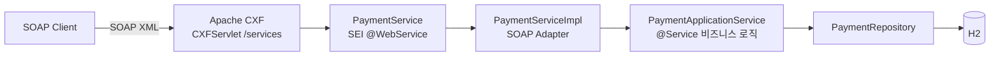

# 카드 결제 SOAP 미션

Spring Boot + Apache CXF 기반 **JAX-WS(Jakarta XML Web Services) 결제 PoC**.

레거시 SOAP 시스템의 `@WebService` SEI + `ServiceImpl` 구조를, 비즈니스 로직이 SOAP에
묶이지 않는 Spring Boot 구조로 옮겨보는 미션입니다.

<br>

## 🎯 학습 목표

- Java First 방식에서 **SEI가 WSDL로 변환되는 과정**을 눈으로 확인한다
- `@WebService`의 `targetNamespace` / `serviceName` / `endpointInterface` 역할을 구분한다
- **Endpoint(어댑터)와 ApplicationService(비즈니스)를 분리**하는 이유를 체감한다
- JAXB가 XML ↔ Java 객체를 마샬링하는 과정을 로그로 관찰한다

<br>

## 🚀 기능 요구사항

### 카드 승인 (`approve`)

- 가맹점 ID, 카드번호, 금액을 받아 결제를 승인한다.
- 승인번호는 `AP` + `yyyyMMdd` + 6자리 난수 형식으로 생성한다. (예: `AP20260911712509`)
- 카드번호는 **마스킹해서만 저장한다.** 앞 6자리와 뒤 4자리를 제외한 나머지를 가린다.
  - `1234567890123456` → `123456******3456`
- 아래 경우에는 예외가 발생해야 한다.
  - 가맹점 ID가 비어 있는 경우
  - 카드번호가 15자리 미만인 경우
  - 금액이 0 이하인 경우

### 카드 취소 (`cancel`)

- 가맹점 ID와 승인번호로 거래를 찾아 취소한다.
- 아래 경우에는 예외가 발생해야 한다.
  - 해당 승인번호의 거래가 없는 경우
  - 이미 취소된 거래인 경우

### 결과 코드

SOAP 응답은 **Fault 대신 결과 코드로 실패를 표현한다.** (레거시 전문 연동 방식)

| 코드 | 의미 |
|---|---|
| `0000` | 성공 |
| `1001` | 승인 요청값 오류 |
| `2001` | 취소 실패 (거래 없음 / 이미 취소됨) |
| `9999` | 시스템 오류 |

<br>

## 📐 프로그래밍 요구사항

- Java 17, Spring Boot 3.5.11, Apache CXF 4.1.5 를 사용한다.
- DB는 H2(in-memory) + Spring Data JPA 를 사용한다.
- **`PaymentService`(SEI)는 외부 계약이다.** 이 인터페이스가 그대로 WSDL로 노출되므로
  내부 사정으로 시그니처를 바꾸지 않는다.
- **`PaymentServiceImpl`에는 비즈니스 로직을 두지 않는다.** DTO ↔ 도메인 변환 후
  ApplicationService에 위임만 한다.
- **`PaymentApplicationService`는 SOAP를 전혀 몰라야 한다.**
  SOAP를 REST로 바꿔도 이 클래스는 그대로 재사용 가능해야 한다.
- 도메인 객체는 setter를 열지 않고, 정적 팩토리 메서드와 의미 있는 메서드로 상태를 바꾼다.
- **커밋 단위는 아래 기능 목록 단위로 한다.**

<br>

## ✅ 구현할 기능 목록

- [x] 도메인 `Payment` / `PaymentStatus` 정의
  - [x] `Payment.approve()` 정적 팩토리로 승인 상태 생성
  - [x] `Payment.cancel()` — 이미 취소된 거래면 예외
- [x] `PaymentRepository` — 가맹점 ID + 승인번호로 거래 조회
- [x] `PaymentApplicationService` 비즈니스 로직
  - [x] 승인 요청값 검증 (가맹점 ID / 카드번호 / 금액)
  - [x] 카드번호 마스킹
  - [x] 승인번호 생성
  - [x] 취소 처리
- [x] SOAP 계약 정의
  - [x] `PaymentService` SEI (`@WebService`)
  - [x] 요청/응답 DTO (JAXB `@XmlType`)
- [x] `PaymentServiceImpl` SOAP 어댑터
  - [x] `CardPaymentMapper` 도메인 ↔ DTO 변환
  - [x] 예외 → 결과 코드 변환
- [x] `CxfConfig` — Endpoint publish + `LoggingFeature`
- [x] 통합 테스트 (`JaxWsProxyFactoryBean` 클라이언트)
- [x] curl 호출 스크립트

<br>

## 📤 실행 결과

### 승인 성공

**요청**

```xml
<soapenv:Envelope xmlns:soapenv="http://schemas.xmlsoap.org/soap/envelope/"
                  xmlns:pay="http://payment.poc.com/">
    <soapenv:Body>
        <pay:approve>
            <request>
                <merchantId>M1001</merchantId>
                <cardNo>1234567890123456</cardNo>
                <amount>10000</amount>
            </request>
        </pay:approve>
    </soapenv:Body>
</soapenv:Envelope>
```

**응답**

```xml
<response>
    <resultCode>0000</resultCode>
    <resultMessage>승인 성공</resultMessage>
    <approvalNo>AP20260911712509</approvalNo>
    <approvedAt>2026-09-11 05:32:04</approvedAt>
</response>
```

### 승인 실패 — 금액이 0 이하

```xml
<response>
    <resultCode>1001</resultCode>
    <resultMessage>금액은 0보다 커야 합니다</resultMessage>
</response>
```

### 취소 성공

```xml
<response>
    <resultCode>0000</resultCode>
    <resultMessage>취소 성공</resultMessage>
    <approvalNo>AP20260911712509</approvalNo>
    <canceledAt>2026-09-11 05:32:07</canceledAt>
</response>
```

### 취소 실패 — 이미 취소된 거래

```xml
<response>
    <resultCode>2001</resultCode>
    <resultMessage>이미 취소된 거래입니다: AP20260911712509</resultMessage>
</response>
```

### 취소 실패 — 거래 없음

```xml
<response>
    <resultCode>2001</resultCode>
    <resultMessage>거래를 찾을 수 없습니다: AP99999999999999</resultMessage>
</response>
```

<br>

## 🏗 아키텍처



```
com.poc.payment
├── config/CxfConfig.java            # Endpoint publish("/payment") + LoggingFeature
├── webservice/card/
│   ├── PaymentService.java          # SEI (@WebService, 외부 계약)
│   ├── PaymentServiceImpl.java      # Endpoint 구현체 (어댑터)
│   ├── dto/                         # SOAP 메시지 계약 (JAXB)
│   └── mapper/CardPaymentMapper.java
├── service/PaymentApplicationService.java
├── domain/Payment.java, PaymentStatus.java
└── repository/PaymentRepository.java
```

<br>

## 🛠 실행 방법

```bash
./gradlew bootRun
```

| 구분 | 주소 |
|---|---|
| SOAP Endpoint | `http://localhost:8080/services/payment` |
| **WSDL** | `http://localhost:8080/services/payment?wsdl` |
| H2 콘솔 | `http://localhost:8080/h2-console` (JDBC URL: `jdbc:h2:mem:paymentdb`) |

### 테스트

**1. curl로 SOAP 직접 호출**

```bash
./scripts/approve.sh                      # 승인
./scripts/cancel.sh AP20260911712509      # 취소 (승인 응답의 approvalNo 사용)
```

**2. 자바 SOAP 클라이언트 통합 테스트** (`JaxWsProxyFactoryBean` 사용)

```bash
./gradlew test
```

**3. SoapUI** — WSDL URL을 임포트하면 요청 템플릿이 자동 생성된다.

> 콘솔에 `LoggingFeature`가 SOAP 요청/응답 XML을 그대로 출력하므로
> JAXB 마샬링 과정을 눈으로 확인할 수 있다.

<br>

## 🔜 다음 단계

- [ ] 조회(inquiry) 오퍼레이션 추가 → WSDL diff 관찰
- [ ] `wsdl2java`로 **Contract First** 버전을 만들어 Java First와 비교
- [ ] WSS4J로 SOAP 헤더 인증(UsernameToken) 추가
- [ ] 두 번째 SEI(예: `TossPayService`) 추가해 멀티 Endpoint 구성
