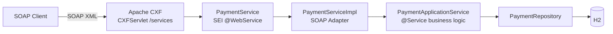

# Card Payment SOAP Interface

**English** | [한국어](README.ko.md) | [简体中文](README.zh-CN.md) | [日本語](README.ja.md)

> A learning PoC that recreates the `@WebService` SEI + `ServiceImpl` structure of a
> legacy SOAP payment system on top of **Spring Boot + Apache CXF (JAX-WS)**

The point is to run into — and work through — the problems that keep coming up in
**SOAP message** integrations rather than modern REST: keeping the contract (WSDL)
separate from the implementation, reporting failures as result codes instead of faults,
and marshalling XML to and from objects.

<br>

## 🎯 Learning Goals

- Watch **how an SEI becomes a WSDL** in the Java First approach
- Tell apart the roles of `targetNamespace` / `serviceName` / `endpointInterface` in `@WebService`
- Feel out why the **endpoint (adapter) and the application service (business logic) are kept apart**
- Observe JAXB marshalling XML to and from Java objects in the logs

<br>

## 🚀 Functional Requirements

### Card approval (`approve`)

- Approve a payment from a merchant ID, a card number and an amount.
- Generate the approval number as `AP` + `yyyyMMdd` + 6 random digits. (e.g. `AP20260911712509`)
- **Only ever store the card number masked.** Hide everything but the first 6 and last 4 digits.
  - `1234567890123456` → `123456******3456`

### Card cancellation (`cancel`)

- Find a transaction by merchant ID and approval number, then cancel it.
- A cancelled transaction moves from `APPROVED` to `CANCELED` and records the cancellation time.

### Error handling

- These approval requests must raise an exception.
  - The merchant ID is blank
  - The card number is shorter than 15 digits
  - The amount is zero or less
- These cancellation requests must raise an exception.
  - No transaction exists for that approval number
  - The transaction is already cancelled
- Exceptions are **never thrown as SOAP faults** — they are translated into result codes.
- Unexpected exceptions collapse into `9999`, and the cause stays in the server log only.

<br>

## 📄 Interface Specification

### Endpoint

| Item | Value |
|---|---|
| targetNamespace | `http://payment.poc.com/` |
| serviceName | `PaymentService` |
| portName | `PaymentServicePort` |
| Endpoint | `http://localhost:8080/services/payment` |
| WSDL | `http://localhost:8080/services/payment?wsdl` |

### Operations

| Operation | Request | Response |
|---|---|---|
| `approve` | `merchantId`, `cardNo`, `amount` | `resultCode`, `resultMessage`, `approvalNo`, `approvedAt` |
| `cancel` | `merchantId`, `approvalNo` | `resultCode`, `resultMessage`, `approvalNo`, `canceledAt` |

The request part is always named `request` and the response part `response`. (`@WebParam` / `@WebResult`)

### Result codes

The SOAP response reports failure **with a result code rather than a fault** — the way
legacy message-based integrations do it.

| Code | Meaning |
|---|---|
| `0000` | Success |
| `1001` | Invalid approval request |
| `2001` | Cancellation failed (no such transaction / already cancelled) |
| `9999` | System error |

### Approval number

```
AP20260911712509
```

| Segment | Example | Meaning |
|---|---|---|
| Prefix | `AP` | Approval |
| Approval date | `20260911` | `yyyyMMdd` |
| Serial | `712509` | 6 random digits |

The approval number is **the key for cancellation requests**. A transaction is looked up
by `merchantId` + `approvalNo`.

<br>

## 📐 Programming Requirements

- Use Java 17, Spring Boot 3.5.11 and Apache CXF 4.1.5.
- Use H2 (in-memory) with Spring Data JPA.
- **`PaymentService` (the SEI) is an external contract.** It is exposed verbatim as the WSDL,
  so its signature must not change for internal reasons.
- **Keep business logic out of `PaymentServiceImpl`.** It converts DTO ↔ domain and
  delegates to the application service, nothing more.
- **`PaymentApplicationService` must know nothing about SOAP.**
  Swapping SOAP for REST should leave this class reusable as is.
- Domain objects expose no setters; state changes go through static factories and
  meaningful methods.
- **Commit granularity follows the feature checklist below.**

<br>

## ✅ Feature Checklist

- [x] `Payment` / `PaymentStatus` domain
  - [x] `Payment.approve()` static factory creating the approved state
  - [x] `Payment.cancel()` — throws if already cancelled
- [x] `PaymentRepository` — look up by merchant ID + approval number
- [x] `PaymentApplicationService` business logic
  - [x] Validate the approval request (merchant ID / card number / amount)
  - [x] Mask the card number
  - [x] Generate the approval number
  - [x] Handle cancellation
  - [ ] Idempotent approvals (reject duplicate requests)
- [x] SOAP contract
  - [x] `PaymentService` SEI (`@WebService`)
  - [x] Request/response DTOs (JAXB `@XmlType`)
  - [ ] `inquiry` operation
- [x] `PaymentServiceImpl` SOAP adapter
  - [x] `CardPaymentMapper` for domain ↔ DTO conversion
  - [x] Exception → result code translation
- [x] `CxfConfig` — endpoint publish + `LoggingFeature`
  - [ ] WS-Security (UsernameToken) header authentication
- [x] Tests
  - [x] Integration test with a `JaxWsProxyFactoryBean` client
  - [x] curl scripts

<br>

## 📤 Results

### Approval succeeds

**Request**

```xml
<soapenv:Envelope xmlns:soapenv="http://schemas.xmlsoap.org/soap/envelope/"
                  xmlns:pay="http://payment.poc.com/">
    <soapenv:Body>
        <pay:approve>
            <request>
                <merchantId>M1001</merchantId>
                <cardNo>1234567890123456</cardNo>
                <amount>10000</amount>
            </request>
        </pay:approve>
    </soapenv:Body>
</soapenv:Envelope>
```

**Response**

```xml
<response>
    <resultCode>0000</resultCode>
    <resultMessage>승인 성공</resultMessage>
    <approvalNo>AP20260911712509</approvalNo>
    <approvedAt>2026-09-11 05:32:04</approvedAt>
</response>
```

### Approval fails — amount is zero or less

```xml
<response>
    <resultCode>1001</resultCode>
    <resultMessage>금액은 0보다 커야 합니다</resultMessage>
</response>
```

### Cancellation succeeds

```xml
<response>
    <resultCode>0000</resultCode>
    <resultMessage>취소 성공</resultMessage>
    <approvalNo>AP20260911712509</approvalNo>
    <canceledAt>2026-09-11 05:32:07</canceledAt>
</response>
```

### Cancellation fails — already cancelled

```xml
<response>
    <resultCode>2001</resultCode>
    <resultMessage>이미 취소된 거래입니다: AP20260911712509</resultMessage>
</response>
```

### Cancellation fails — no such transaction

```xml
<response>
    <resultCode>2001</resultCode>
    <resultMessage>거래를 찾을 수 없습니다: AP99999999999999</resultMessage>
</response>
```

> Result messages are in Korean because they come straight from the domain code.

<br>

## 🏗 Architecture



The SOAP contract (the adapter) is kept apart from the business logic.

```
com.poc.payment
├── config/
│   └── CxfConfig.java               # Endpoint publish("/payment") + LoggingFeature
├── webservice/card/                 # SOAP adapter layer (the external contract)
│   ├── PaymentService.java          # SEI (@WebService) — becomes the WSDL verbatim
│   ├── PaymentServiceImpl.java      # Endpoint impl, exception → result code
│   ├── dto/                         # SOAP message contract (JAXB @XmlType)
│   └── mapper/                      # CardPaymentMapper — domain ↔ DTO
├── service/                         # PaymentApplicationService (knows nothing of SOAP)
├── domain/                          # Payment (state machine), PaymentStatus
└── repository/                      # Spring Data JPA
```

Because the business layer knows nothing about SOAP, swapping SOAP for REST leaves
everything under `service` reusable as is.

<br>

## 🛠 Tech Stack

| Area | Technology |
|---|---|
| Language | Java 17 |
| Framework | Spring Boot 3.5.11 |
| SOAP | Apache CXF 4.1.5 (`cxf-spring-boot-starter-jaxws`), JAX-WS / JAXB |
| Persistence | Spring Data JPA, H2 (in-memory) |
| Build | Gradle |
| SOAP logging | `cxf-rt-features-logging` (`LoggingFeature`) |

<br>

## 🏃 Getting Started

```bash
# 1. Run the application
./gradlew bootRun

# 2. Check the WSDL — the SEI turned into a contract
curl http://localhost:8080/services/payment?wsdl

# 3. Call approve
./scripts/approve.sh
```

| Item | Address |
|---|---|
| SOAP endpoint | `http://localhost:8080/services/payment` |
| **WSDL** | `http://localhost:8080/services/payment?wsdl` |
| H2 console | `http://localhost:8080/h2-console` (JDBC URL `jdbc:h2:mem:paymentdb`, user `sa`, no password) |

Approvals and cancellations can be inspected in the H2 console.

```sql
SELECT * FROM payments;  -- check status = APPROVED / CANCELED and masked_card_no
```

### Tests

```bash
./gradlew test
```

- `PaymentSoapIntegrationTest` — drives the approve/cancel scenarios through a
  `JaxWsProxyFactoryBean` Java SOAP client

You can also send the SOAP messages directly with curl.

```bash
./scripts/approve.sh                      # approve
./scripts/cancel.sh AP20260911712509      # cancel (use approvalNo from the approval response)
```

**SoapUI** — importing the WSDL URL generates the request templates for you.

> `LoggingFeature` prints the SOAP request and response XML to the console as is,
> so you can watch JAXB marshalling with your own eyes.

<br>

## 🤔 Design Decisions

| Topic | Choice | Why |
|---|---|---|
| WSDL generation | Java First (`@WebService` SEI) | Chosen to watch the SEI itself become the contract |
| Reporting failure | Result codes instead of faults | The legacy message-integration convention: clients branch on a code, not a stack trace |
| Layering | Endpoint (adapter) / application service (business) | Swapping SOAP for REST leaves the business logic reusable |
| Message contract | Separate JAXB DTOs rather than the domain | Domain fields can change without breaking the external contract (the WSDL) |
| Exception mapping | Business throws, the adapter translates to a code | The business layer need not know the code scheme |
| Card number | Only the masked value is stored | The original is never kept; masking belongs to the business layer |
| Domain state changes | Static factory + `cancel()` | No setters. The domain itself guards against "already cancelled" |

<br>

## ⚠️ Known Simplifications

Deliberately left out to keep the PoC small. Each has to be resolved before any real use.

- **No authentication or encryption** — neither WS-Security (UsernameToken) nor HTTPS is in place. A real external interface needs both.
- **`LoggingFeature` prints the whole request XML** — it is there to watch marshalling. Plaintext card numbers end up in the log, so it cannot stay on in production.
- **Approvals are not idempotent** — sending the same request twice creates two approvals. Real systems need duplicate detection keyed on a transaction ID.
- **The approval number is 6 random digits** — a same-day collision hits the unique constraint and comes back as `9999`. Real systems use a sequence or a numbering service.
- **Java First** — editing the SEI changes the WSDL immediately. Where the external contract is agreed up front, Contract First is safer.
- **H2 in-memory** — transaction data is gone on restart.

<br>

## 🗺 Roadmap

- [ ] Add an `inquiry` operation and watch the WSDL diff
- [ ] Build a **Contract First** version with `wsdl2java` and compare it against Java First
- [ ] Add SOAP header authentication (UsernameToken) with WSS4J
- [ ] Add a second SEI (say `TossPayService`) for a multi-endpoint setup
- [ ] Idempotent approvals (duplicate detection keyed on a transaction ID)
