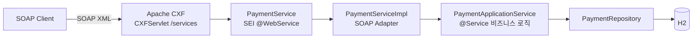

# payment-soap-poc

Spring Boot + Apache CXF 기반 **JAX-WS(Jakarta XML Web Services) SOAP 결제 PoC**.

레거시 SOAP 시스템의 `@WebService` SEI + `ServiceImpl` 구조를 현대적인 Spring Boot 구조로 옮기는 연습 프로젝트입니다.

## 스택

| 구분 | 내용 |
|---|---|
| Java | 17 |
| Spring Boot | 3.5.11 |
| Apache CXF | 4.1.5 (`cxf-spring-boot-starter-jaxws`) |
| DB | H2 (in-memory) + Spring Data JPA |

## 아키텍처



핵심 설계 원칙:

- **`PaymentService`(SEI)** = 외부 계약. WSDL로 그대로 노출됨 (Java First)
- **`PaymentServiceImpl`** = SOAP 어댑터. DTO↔도메인 변환 후 위임만 함
- **`PaymentApplicationService`** = 진짜 비즈니스 로직. SOAP를 전혀 모름 → REST로 바꿔도 재사용 가능

## 패키지 구조

```
com.poc.payment
├── config/CxfConfig.java            # Endpoint publish("/payment") + LoggingFeature
├── webservice/card/
│   ├── PaymentService.java          # SEI (@WebService, 외부 계약)
│   ├── PaymentServiceImpl.java      # Endpoint 구현체 (어댑터)
│   ├── dto/                         # SOAP 메시지 계약 (JAXB)
│   └── mapper/CardPaymentMapper.java
├── service/PaymentApplicationService.java
├── domain/Payment.java, PaymentStatus.java
└── repository/PaymentRepository.java
```

## 실행

```bash
./gradlew bootRun     # 로컬에 gradle 있으면 gradle bootRun
```

- SOAP Endpoint: `http://localhost:8080/services/payment`
- **WSDL**: `http://localhost:8080/services/payment?wsdl`
- H2 콘솔: `http://localhost:8080/h2-console` (JDBC URL: `jdbc:h2:mem:paymentdb`)

## 테스트

**1. curl로 SOAP 직접 호출**

```bash
./scripts/approve.sh                      # 승인
./scripts/cancel.sh AP20260911123456      # 취소 (승인 응답의 approvalNo 사용)
```

**2. 자바 SOAP 클라이언트 통합 테스트** (`JaxWsProxyFactoryBean` 사용)

```bash
./gradlew test
```

**3. SoapUI** — WSDL URL 임포트하면 요청 템플릿 자동 생성

콘솔에 `LoggingFeature`가 SOAP 요청/응답 XML을 그대로 출력하므로 JAXB 마샬링 과정을 눈으로 확인할 수 있습니다.

## 학습 포인트 체크리스트

- [ ] `?wsdl` 열어서 SEI가 WSDL로 어떻게 변환되는지 확인 (Java First)
- [ ] `@WebService`의 `targetNamespace` / `serviceName` / `endpointInterface` 역할 구분
- [ ] Endpoint(어댑터)와 ApplicationService(비즈니스)의 분리 이유 체감
- [ ] 로그로 XML ↔ Java 객체(JAXB) 변환 과정 관찰

## 다음 확장 아이디어

1. 조회(inquiry) 오퍼레이션 추가 → WSDL diff 관찰
2. `wsdl2java`로 **Contract First** 버전 만들어 Java First와 비교
3. WSS4J로 SOAP 헤더 인증(UsernameToken) 추가
4. 두 번째 SEI(예: `TossPayService`) 추가해 멀티 Endpoint 구성
