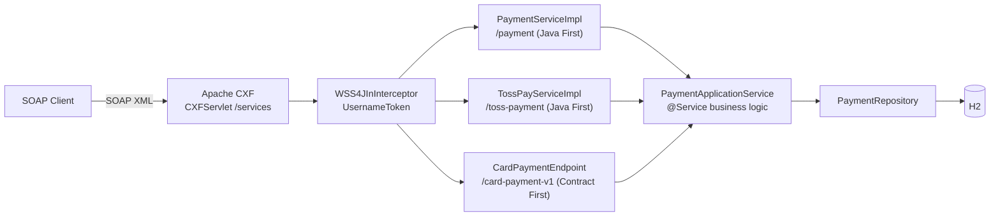

# Card Payment SOAP Interface

**English** | [한국어](README.ko.md) | [简体中文](README.zh-CN.md) | [日本語](README.ja.md)

> A learning PoC that recreates the `@WebService` SEI + `ServiceImpl` structure of a
> legacy SOAP payment system on top of **Spring Boot + Apache CXF (JAX-WS)**

The point is to run into — and work through — the problems that keep coming up in
**SOAP message** integrations rather than modern REST: keeping the contract (WSDL)
separate from the implementation, reporting failures as result codes instead of faults,
and marshalling XML to and from objects.

<br>

## 🎯 Learning Goals

- Watch **how an SEI becomes a WSDL** in the Java First approach
- Tell apart the roles of `targetNamespace` / `serviceName` / `endpointInterface` in `@WebService`
- Feel out why the **endpoint (adapter) and the application service (business logic) are kept apart**
- Observe JAXB marshalling XML to and from Java objects in the logs
- Compare **Java First against Contract First** on the same business layer, and see what each
  one lets the contract say
- Put **WS-Security (UsernameToken)** in front of the endpoints and watch where a protocol
  error parts ways with a business error

<br>

## 🚀 Functional Requirements

### Card approval (`approve`)

- Approve a payment from a merchant ID, a card number and an amount.
- Generate the approval number as `AP` + `yyyyMMdd` + 6 random digits. (e.g. `AP20260911712509`)
- **Only ever store the card number masked.** Hide everything but the first 6 and last 4 digits.
  - `1234567890123456` → `123456******3456`

### Card cancellation (`cancel`)

- Find a transaction by merchant ID and approval number, then cancel it.
- A cancelled transaction moves from `APPROVED` to `CANCELED` and records the cancellation time.

### Transaction inquiry (`inquiry`)

- Look a transaction up by merchant ID and approval number and return its current state.
- Added to watch what a single extra SEI method does to the WSDL — see
  [docs/wsdl-diff.md](docs/wsdl-diff.md).

### Idempotent approval

- Every approval request carries a merchant-issued transaction ID (`txId`).
- The same `(merchantId, txId)` pair never produces a second approval: the original approval
  is returned as is, with `duplicated` set to `true`.
- A unique constraint on `(merchant_id, tx_id)` backs the pre-check up.

### Header authentication

- Every endpoint requires a WS-Security `UsernameToken` (`PasswordText`) in the SOAP header.
- Authentication failure is the one case reported as a **SOAP fault**, not a result code:
  it happens before the message reaches business code.

### Error handling

- These approval requests must raise an exception.
  - The merchant ID is blank
  - The card number is shorter than 15 digits
  - The amount is zero or less
- These cancellation requests must raise an exception.
  - No transaction exists for that approval number
  - The transaction is already cancelled
- Exceptions are **never thrown as SOAP faults** — they are translated into result codes.
- Unexpected exceptions collapse into `9999`, and the cause stays in the server log only.

<br>

## 📄 Interface Specification

### Endpoints

Three contracts are published, all of them on one business layer.

| | Card (Java First) | Toss (Java First) | Card v1 (Contract First) |
|---|---|---|---|
| targetNamespace | `http://payment.poc.com/` | `http://toss.payment.poc.com/` | `http://contract.payment.poc.com/v1` |
| serviceName | `PaymentService` | `TossPayService` | `CardPaymentService` |
| portName | `PaymentServicePort` | `TossPayServicePort` | `CardPaymentPort` |
| Endpoint | `/services/payment` | `/services/toss-payment` | `/services/card-payment-v1` |
| Contract source | the SEI | the SEI | `src/main/resources/wsdl/card-payment-v1.wsdl` |

All three are under `http://localhost:8080`, and each serves its own `?wsdl`.

### Operations

**Card contract** — the request part is always named `request` and the response part `response`
(`@WebParam` / `@WebResult`).

| Operation | Request | Response |
|---|---|---|
| `approve` | `merchantId`, `txId`, `cardNo`, `amount` | `resultCode`, `resultMessage`, `approvalNo`, `approvedAt`, `duplicated` |
| `cancel` | `merchantId`, `approvalNo` | `resultCode`, `resultMessage`, `approvalNo`, `canceledAt` |
| `inquiry` | `merchantId`, `approvalNo` | `resultCode`, `resultMessage`, `approvalNo`, `status`, `maskedCardNo`, `amount`, `approvedAt`, `canceledAt` |

**Toss contract** — the same business, a different vocabulary. `orderId` is the idempotency key here.

| Operation | Request | Response |
|---|---|---|
| `pay` | `storeId`, `orderId`, `payToken`, `totalAmount` | `status` (`DONE` / `ABORTED`), `paymentKey`, `orderId`, `message`, `approvedAt`, `duplicated` |
| `cancelPay` | `storeId`, `paymentKey`, `cancelReason` | `status` (`CANCELED` / `ABORTED`), `paymentKey`, `message`, `canceledAt` |

**Contract First contract** — typed where the Java First one used strings (`xs:dateTime`,
`xs:enumeration`), and schema facets are enforced at the XML layer.

| Operation | Request | Response |
|---|---|---|
| `approveCard` | `merchantId`, `txId`, `cardNo`, `amount` | `resultCode`, `resultMessage`, `approvalNo`, `approvedAt`, `duplicated` |
| `inquireCard` | `merchantId`, `approvalNo` | `resultCode`, `resultMessage`, `approvalNo`, `status`, `maskedCardNo`, `amount`, `approvedAt`, `canceledAt` |

### Result codes

The SOAP response reports failure **with a result code rather than a fault** — the way
legacy message-based integrations do it.

| Code | Meaning |
|---|---|
| `0000` | Success |
| `1001` | Invalid approval request |
| `2001` | Cancellation failed (no such transaction / already cancelled) |
| `3001` | Inquiry failed (no such transaction) |
| `9999` | System error |

Authentication is the exception to the rule. A missing or wrong `UsernameToken` comes back as a
fault, because the message never reaches the layer that owns the result codes.

```xml
<soap:Fault>
  <faultcode xmlns:ns1="http://ws.apache.org/wss4j">ns1:SecurityError</faultcode>
  <faultstring>A security error was encountered when verifying the message</faultstring>
</soap:Fault>
```

### Approval number

```
AP20260911712509
```

| Segment | Example | Meaning |
|---|---|---|
| Prefix | `AP` | Approval |
| Approval date | `20260911` | `yyyyMMdd` |
| Serial | `712509` | 6 random digits |

The approval number is **the key for cancellation and inquiry requests**. A transaction is
looked up by `merchantId` + `approvalNo`.

### Transaction ID (`txId`)

The caller issues it, and it is the key for **duplicate detection**, not for lookups. Send the same
`(merchantId, txId)` twice and the second response carries the first approval number with
`duplicated` set to `true` — the amount is not re-approved and not overwritten.

<br>

## 📐 Programming Requirements

- Use Java 17, Spring Boot 3.5.11 and Apache CXF 4.1.5.
- Use H2 (in-memory) with Spring Data JPA.
- **`PaymentService` (the SEI) is an external contract.** It is exposed verbatim as the WSDL,
  so its signature must not change for internal reasons.
- **Keep business logic out of `PaymentServiceImpl`.** It converts DTO ↔ domain and
  delegates to the application service, nothing more.
- **`PaymentApplicationService` must know nothing about SOAP.**
  Swapping SOAP for REST should leave this class reusable as is.
- Domain objects expose no setters; state changes go through static factories and
  meaningful methods.
- **A second contract must not add business logic.** A new SEI gets a new adapter and a new
  mapper, nothing else.
- **Contract First sources are generated, not committed.** `wsdl2java` runs as part of the build
  from the hand-written WSDL.
- **Commit granularity follows the feature checklist below.**

<br>

## ✅ Feature Checklist

- [x] `Payment` / `PaymentStatus` domain
  - [x] `Payment.approve()` static factory creating the approved state
  - [x] `Payment.cancel()` — throws if already cancelled
- [x] `PaymentRepository` — look up by merchant ID + approval number
- [x] `PaymentApplicationService` business logic
  - [x] Validate the approval request (merchant ID / card number / amount)
  - [x] Mask the card number
  - [x] Generate the approval number
  - [x] Handle cancellation
  - [x] Inquiry (read-only transaction)
  - [x] Idempotent approvals — duplicate detection keyed on `txId`
- [x] SOAP contract
  - [x] `PaymentService` SEI (`@WebService`)
  - [x] Request/response DTOs (JAXB `@XmlType`)
  - [x] `inquiry` operation
  - [x] Second SEI (`TossPayService`) on its own namespace
  - [x] Contract First WSDL + `wsdl2java` codegen (`CardPaymentPortType`)
- [x] SOAP adapters
  - [x] `CardPaymentMapper` for domain ↔ DTO conversion
  - [x] Exception → result code translation
  - [x] `TossPayMapper` — the same domain in a different vocabulary
  - [x] `ContractCardMapper` — `LocalDateTime` ↔ `xs:dateTime`, status ↔ schema enum
- [x] `CxfConfig` — endpoint publish + `LoggingFeature`
  - [x] Multi-endpoint publish (card / toss / contract-first)
  - [x] WS-Security (UsernameToken) header authentication
  - [x] `schema-validation-enabled` on the Contract First endpoint
- [x] Tests (24)
  - [x] Integration test with a `JaxWsProxyFactoryBean` client
  - [x] curl scripts
  - [x] `TossPaySoapIntegrationTest` — second contract, plus a cross-contract inquiry
  - [x] `WsSecurityIntegrationTest` — missing / wrong / unknown credentials
  - [x] `ContractFirstIntegrationTest` — generated SEI, schema rejection, published WSDL

<br>

## 📤 Results

### Approval succeeds

**Request**

```xml
<soapenv:Envelope xmlns:soapenv="http://schemas.xmlsoap.org/soap/envelope/"
                  xmlns:pay="http://payment.poc.com/">
    <soapenv:Header>
        <wsse:Security soapenv:mustUnderstand="1"
                       xmlns:wsse="http://docs.oasis-open.org/wss/2004/01/oasis-200401-wss-wssecurity-secext-1.0.xsd">
            <wsse:UsernameToken>
                <wsse:Username>poc-client</wsse:Username>
                <wsse:Password Type="...#PasswordText">poc-secret</wsse:Password>
            </wsse:UsernameToken>
        </wsse:Security>
    </soapenv:Header>
    <soapenv:Body>
        <pay:approve>
            <request>
                <merchantId>M1001</merchantId>
                <txId>TX-20260911-0001</txId>
                <cardNo>1234567890123456</cardNo>
                <amount>10000</amount>
            </request>
        </pay:approve>
    </soapenv:Body>
</soapenv:Envelope>
```

**Response**

```xml
<response>
    <resultCode>0000</resultCode>
    <resultMessage>승인 성공</resultMessage>
    <approvalNo>AP20260911712509</approvalNo>
    <approvedAt>2026-09-11 05:32:04</approvedAt>
    <duplicated>false</duplicated>
</response>
```

### The same request again — the approval is not repeated

```xml
<response>
    <resultCode>0000</resultCode>
    <resultMessage>이미 승인된 거래입니다 (기존 승인 반환)</resultMessage>
    <approvalNo>AP20260911712509</approvalNo>
    <approvedAt>2026-09-11 05:32:04</approvedAt>
    <duplicated>true</duplicated>
</response>
```

### Approval fails — amount is zero or less

```xml
<response>
    <resultCode>1001</resultCode>
    <resultMessage>금액은 0보다 커야 합니다</resultMessage>
</response>
```

### Cancellation succeeds

```xml
<response>
    <resultCode>0000</resultCode>
    <resultMessage>취소 성공</resultMessage>
    <approvalNo>AP20260911712509</approvalNo>
    <canceledAt>2026-09-11 05:32:07</canceledAt>
</response>
```

### Cancellation fails — already cancelled

```xml
<response>
    <resultCode>2001</resultCode>
    <resultMessage>이미 취소된 거래입니다: AP20260911712509</resultMessage>
</response>
```

### Cancellation fails — no such transaction

```xml
<response>
    <resultCode>2001</resultCode>
    <resultMessage>거래를 찾을 수 없습니다: AP99999999999999</resultMessage>
</response>
```

### Inquiry succeeds

```xml
<response>
    <resultCode>0000</resultCode>
    <resultMessage>조회 성공</resultMessage>
    <approvalNo>AP20260911712509</approvalNo>
    <status>APPROVED</status>
    <maskedCardNo>123456******3456</maskedCardNo>
    <amount>10000</amount>
    <approvedAt>2026-09-11 05:32:04</approvedAt>
</response>
```

### Authentication fails — no `UsernameToken`

```xml
<soap:Fault>
    <faultcode xmlns:ns1="http://ws.apache.org/wss4j">ns1:SecurityError</faultcode>
    <faultstring>A security error was encountered when verifying the message</faultstring>
</soap:Fault>
```

### The Toss contract, same business

```xml
<response>
    <status>DONE</status>
    <paymentKey>AP20260911712509</paymentKey>
    <orderId>ORDER-20260911-0001</orderId>
    <message>결제 완료</message>
    <approvedAt>2026-09-11T05:32:04</approvedAt>
    <duplicated>false</duplicated>
</response>
```

### Contract First — the schema refuses the request

The Java First endpoint answers the same invalid amount with result code `1001`. Here the
contract rejects it before any business code runs.

```xml
<soap:Fault>
    <faultcode>soap:Client</faultcode>
    <faultstring>Unmarshalling Error: cvc-minExclusive-valid: Value '-100' is not facet-valid
with respect to minExclusive '0.0' for type 'Amount'.</faultstring>
</soap:Fault>
```

> Result messages are in Korean because they come straight from the domain code.

<br>

## 🏗 Architecture



Three contracts, three adapters, one business layer. Authentication sits in front of all of
them, and nothing below the adapters knows that SOAP exists.

```
com.poc.payment
├── config/
│   └── CxfConfig.java               # 3 endpoint publishes + LoggingFeature + WSS4J interceptor
├── security/
│   ├── SoapSecurityProperties.java  # soap.security.* credentials
│   └── UsernameTokenCallbackHandler.java
├── webservice/card/                 # Java First contract (the external contract)
│   ├── PaymentService.java          # SEI (@WebService) — becomes the WSDL verbatim
│   ├── PaymentServiceImpl.java      # Endpoint impl, exception → result code
│   ├── dto/                         # SOAP message contract (JAXB @XmlType)
│   └── mapper/                      # CardPaymentMapper — domain ↔ DTO
├── webservice/toss/                 # Second Java First contract, its own namespace
│   ├── TossPayService.java          # SEI — storeId / orderId / payToken
│   ├── TossPayServiceImpl.java
│   ├── dto/
│   └── mapper/                      # TossPayMapper — status strings instead of result codes
├── webservice/contract/             # Contract First adapter
│   ├── CardPaymentEndpoint.java     # implements the generated CardPaymentPortType
│   └── ContractCardMapper.java      # LocalDateTime ↔ xs:dateTime, status ↔ schema enum
├── service/                         # PaymentApplicationService, ApprovalResult (no SOAP here)
├── domain/                          # Payment (state machine), PaymentStatus
└── repository/                      # Spring Data JPA

src/main/resources/wsdl/
└── card-payment-v1.wsdl             # hand-written contract → wsdl2java → build/generated/
```

Because the business layer knows nothing about SOAP, swapping SOAP for REST leaves
everything under `service` reusable as is — which is exactly what adding the second and third
contracts demonstrated: neither of them added a line of business logic.

<br>

## 🛠 Tech Stack

| Area | Technology |
|---|---|
| Language | Java 17 |
| Framework | Spring Boot 3.5.11 |
| SOAP | Apache CXF 4.1.5 (`cxf-spring-boot-starter-jaxws`), JAX-WS / JAXB |
| Persistence | Spring Data JPA, H2 (in-memory) |
| Build | Gradle |
| SOAP logging | `cxf-rt-features-logging` (`LoggingFeature`) |
| WS-Security | `cxf-rt-ws-security` (WSS4J `UsernameToken`) |
| Codegen | `cxf-tools-wsdlto-*` run from a Gradle `JavaExec` task (`./gradlew wsdl2java`) |

<br>

## 🏃 Getting Started

```bash
# 1. Run the application
./gradlew bootRun

# 2. Check the WSDL — the SEI turned into a contract
curl http://localhost:8080/services/payment?wsdl

# 3. Call approve (the script carries the UsernameToken header)
./scripts/approve.sh TX-1

# 4. Send it again — the approval is not repeated
./scripts/approve.sh TX-1
```

| Item | Address |
|---|---|
| Card endpoint (Java First) | `http://localhost:8080/services/payment` |
| Toss endpoint (Java First) | `http://localhost:8080/services/toss-payment` |
| Card v1 endpoint (Contract First) | `http://localhost:8080/services/card-payment-v1` |
| **WSDL** | add `?wsdl` to any of the three |
| Service list | `http://localhost:8080/services` |
| H2 console | `http://localhost:8080/h2-console` (JDBC URL `jdbc:h2:mem:paymentdb`, user `sa`, no password) |

Every endpoint requires the `wsse:UsernameToken` header (`poc-client` / `poc-secret`, configured
under `soap.security` in `application.yml`). Calls without it come back as a fault.

Approvals and cancellations can be inspected in the H2 console.

```sql
SELECT * FROM payments;  -- check status = APPROVED / CANCELED and masked_card_no
```

### Tests

```bash
./gradlew test
```

- `PaymentSoapIntegrationTest` — approve / cancel / inquiry and idempotency through a
  `JaxWsProxyFactoryBean` Java SOAP client
- `TossPaySoapIntegrationTest` — the second contract, including a transaction approved through
  Toss and then read back through the card contract
- `WsSecurityIntegrationTest` — missing, wrong and unknown credentials
- `ContractFirstIntegrationTest` — the generated SEI, schema rejection, and the published WSDL

You can also send the SOAP messages directly with curl.

```bash
./scripts/approve.sh TX-1                 # approve (same txId twice → duplicated=true)
./scripts/cancel.sh AP20260911712509      # cancel (use approvalNo from the approval response)
./scripts/inquiry.sh AP20260911712509     # inquiry
./scripts/toss-pay.sh ORDER-1             # the Toss contract
./scripts/contract-approve.sh TX-2        # the Contract First endpoint
./scripts/contract-approve.sh TX-3 -100   # …and what a schema violation looks like
```

The codegen step runs on its own, but you can also run it by hand:

```bash
./gradlew wsdl2java   # build/generated/wsdl2java from src/main/resources/wsdl/card-payment-v1.wsdl
```

**SoapUI** — importing the WSDL URL generates the request templates for you.

> `LoggingFeature` prints the SOAP request and response XML to the console as is,
> so you can watch JAXB marshalling with your own eyes.

<br>

## 🤔 Design Decisions

| Topic | Choice | Why |
|---|---|---|
| WSDL generation | Java First (`@WebService` SEI) | Chosen to watch the SEI itself become the contract |
| Reporting failure | Result codes instead of faults | The legacy message-integration convention: clients branch on a code, not a stack trace |
| Layering | Endpoint (adapter) / application service (business) | Swapping SOAP for REST leaves the business logic reusable |
| Message contract | Separate JAXB DTOs rather than the domain | Domain fields can change without breaking the external contract (the WSDL) |
| Exception mapping | Business throws, the adapter translates to a code | The business layer need not know the code scheme |
| Card number | Only the masked value is stored | The original is never kept; masking belongs to the business layer |
| Domain state changes | Static factory + `cancel()` | No setters. The domain itself guards against "already cancelled" |
| Idempotency key | Caller-issued `txId`, unique per `(merchantId, txId)` | The caller owns retries, so the caller owns the key. A pre-check answers, the constraint guarantees |
| Duplicate approvals | Return the original approval with `duplicated = true` | A retry is not an error. Re-approving, or overwriting the amount, would be |
| Authentication | WSS4J interceptor, not business code | The business layer stays unaware of credentials, and the check happens before unmarshalling |
| Authentication failure | SOAP fault, unlike every other failure | The message never reaches the layer that owns result codes. Faking a `9999` would hide a protocol error as a business one |
| Multiple contracts | One SEI per contract, one namespace per SEI | `TossPayService` could get its own vocabulary without touching the card contract |
| Contract First alongside Java First | Both published, same business layer | The comparison is the point — see [docs/contract-first.md](docs/contract-first.md) |
| Generated sources | Generated into `build/`, never committed | Editing the WSDL has to be what changes the Java, otherwise the direction of dependency is a fiction |

<br>

## ⚠️ Known Simplifications

Deliberately left out to keep the PoC small. Each has to be resolved before any real use.

- **No HTTPS** — the `UsernameToken` is now in place, but `PasswordText` over plain HTTP puts the password on the wire in the clear. A real external interface needs TLS, and ideally a digest or signature instead of a plaintext password.
- **One credential pair in `application.yml`** — in the clear, the same for every caller. Real systems keep per-client credentials in a store and rotate them.
- **`LoggingFeature` prints the whole request XML** — it is there to watch marshalling. Plaintext card numbers *and the password* end up in the log, so it cannot stay on in production.
- **Security is not in the contract** — the requirement lives in an interceptor, so `?wsdl` says nothing about it. A WS-SecurityPolicy assertion is what makes it discoverable.
- **`opensaml` is excluded from `cxf-rt-ws-security`** — only `UsernameToken` is used, and those artifacts are not on Maven Central. Any SAML-based token would need the Shibboleth repository added back.
- **Concurrent duplicates are refused, not merged** — two simultaneous requests with the same `txId` leave one approval, and the loser gets `9999` from the unique-constraint violation rather than a copy of the winner's approval. A retry a moment later gets the original approval back.
- **The approval number is 6 random digits** — a same-day collision hits the unique constraint and comes back as `9999`. Real systems use a sequence or a numbering service.
- **Contract First covers only part of the surface** — `card-payment-v1.wsdl` has approve and inquire, not cancel, and the Java First contracts remain the primary ones.
- **`xs:dateTime` is mapped by hand** — `ContractCardMapper` converts `LocalDateTime` to `XMLGregorianCalendar` on every call. A JAXB binding file with an `XmlAdapter` is the real answer.
- **H2 in-memory** — transaction data is gone on restart.

<br>

## 🗺 Roadmap

Done:

- [x] Add an `inquiry` operation and watch the WSDL diff → [docs/wsdl-diff.md](docs/wsdl-diff.md)
- [x] Build a **Contract First** version with `wsdl2java` and compare it against Java First → [docs/contract-first.md](docs/contract-first.md)
- [x] Add SOAP header authentication (UsernameToken) with WSS4J
- [x] Add a second SEI (`TossPayService`) for a multi-endpoint setup
- [x] Idempotent approvals (duplicate detection keyed on a transaction ID)

Next, in the order the known simplifications above hurt:

- [ ] HTTPS, and a digest or signature instead of `PasswordText`
- [ ] Publish the security requirement as a WS-SecurityPolicy assertion so the WSDL carries it
- [ ] Per-client credentials out of `application.yml`
- [ ] Scrub card numbers and passwords from the `LoggingFeature` output instead of turning it off
- [ ] Serve the original approval to the loser of a concurrent duplicate, instead of `9999`
- [ ] A numbering service for approval numbers, replacing the 6 random digits
- [ ] A JAXB binding file so `xs:dateTime` maps straight to `LocalDateTime`
