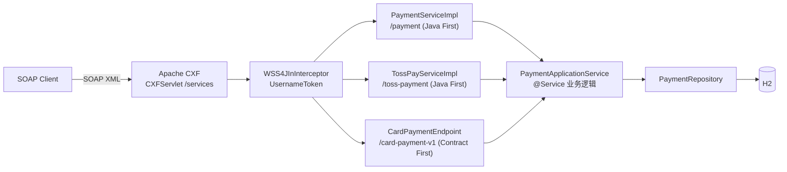

# 银行卡支付 SOAP 接口

[English](README.md) | [한국어](README.ko.md) | **简体中文** | [日本語](README.ja.md)

> 在 **Spring Boot + Apache CXF (JAX-WS)** 上复现遗留 SOAP 支付系统的
> `@WebService` SEI + `ServiceImpl` 结构的学习型 PoC

目标是亲自遇到并解决用 **SOAP 报文**（而非 REST）做对接时反复出现的问题
—— 契约（WSDL）与实现的分离、用结果码而非 Fault 表达失败、XML ↔ 对象的编组。

<br>

## 🎯 学习目标

- 在 Java First 方式下，亲眼确认 **SEI 转换成 WSDL 的过程**
- 区分 `@WebService` 中 `targetNamespace` / `serviceName` / `endpointInterface` 的作用
- 体会**将 Endpoint（适配器）与 ApplicationService（业务逻辑）分离**的理由
- 通过日志观察 JAXB 在 XML ↔ Java 对象之间编组的过程
- 在同一套业务层之上**并列比较 Java First 与 Contract First**，
  看清两种方式各自能把什么写进契约
- 在 Endpoint 前面加上 **WS-Security（UsernameToken）**，
  观察协议错误与业务错误分道扬镳的那个位置

<br>

## 🚀 功能需求

### 支付授权 (`approve`)

- 接收商户 ID、卡号、金额并完成授权。
- 授权号按 `AP` + `yyyyMMdd` + 6 位随机数的格式生成。（例：`AP20260911712509`）
- 卡号**只以掩码形式保存**。除前 6 位和后 4 位外全部遮蔽。
  - `1234567890123456` → `123456******3456`

### 交易撤销 (`cancel`)

- 用商户 ID 和授权号查找交易并撤销。
- 被撤销的交易状态从 `APPROVED` 变为 `CANCELED`，并记录撤销时间。

### 交易查询 (`inquiry`)

- 用商户 ID 和授权号查找交易并返回当前状态。
- 加这个操作是为了看清：SEI 多一个方法，WSDL 会变到什么程度 →
  [docs/wsdl-diff.md](docs/wsdl-diff.md)

### 授权幂等性

- 所有授权请求都要带上商户分配的交易唯一号（`txId`）。
- 同一个 `(merchantId, txId)` 不会产生第二笔授权：原样返回已有授权，
  并把 `duplicated` 置为 `true`。
- 仅靠事前查询挡不住并发请求，因此由 `(merchant_id, tx_id)` 唯一约束兜底。

### 报文头认证

- 所有 Endpoint 都要求 SOAP 报文头中带 WS-Security `UsernameToken`（`PasswordText`）。
- 认证失败是唯一用 **SOAP Fault** 而非结果码表达的失败：
  报文还没到业务代码就被拦下了。

### 异常处理

- 以下授权请求必须抛出异常。
  - 商户 ID 为空
  - 卡号不足 15 位
  - 金额小于等于 0
- 以下撤销请求必须抛出异常。
  - 该授权号对应的交易不存在
  - 交易已被撤销
- 发生的异常**不以 SOAP Fault 抛出，而是转换为结果码**返回。
- 未预期的异常统一归为 `9999`，原因只保留在服务端日志中。

<br>

## 📄 接口规格

### Endpoint

一共 publish 了 3 个契约，它们背后的业务层只有一个。

| 项目 | 银行卡 (Java First) | Toss (Java First) | 银行卡 v1 (Contract First) |
|---|---|---|---|
| targetNamespace | `http://payment.poc.com/` | `http://toss.payment.poc.com/` | `http://contract.payment.poc.com/v1` |
| serviceName | `PaymentService` | `TossPayService` | `CardPaymentService` |
| portName | `PaymentServicePort` | `TossPayServicePort` | `CardPaymentPort` |
| Endpoint | `/services/payment` | `/services/toss-payment` | `/services/card-payment-v1` |
| 契约原件 | SEI | SEI | `src/main/resources/wsdl/card-payment-v1.wsdl` |

三者都在 `http://localhost:8080` 之下，各自提供自己的 `?wsdl`。

### 操作

**银行卡契约** —— 请求部件名固定为 `request`，响应部件名固定为 `response`。
(`@WebParam` / `@WebResult`)

| 操作 | 请求 | 响应 |
|---|---|---|
| `approve` | `merchantId`、`txId`、`cardNo`、`amount` | `resultCode`、`resultMessage`、`approvalNo`、`approvedAt`、`duplicated` |
| `cancel` | `merchantId`、`approvalNo` | `resultCode`、`resultMessage`、`approvalNo`、`canceledAt` |
| `inquiry` | `merchantId`、`approvalNo` | `resultCode`、`resultMessage`、`approvalNo`、`status`、`maskedCardNo`、`amount`、`approvedAt`、`canceledAt` |

**Toss 契约** —— 同一套业务，另一套词汇。这里 `orderId` 就是幂等键。

| 操作 | 请求 | 响应 |
|---|---|---|
| `pay` | `storeId`、`orderId`、`payToken`、`totalAmount` | `status`（`DONE` / `ABORTED`）、`paymentKey`、`orderId`、`message`、`approvedAt`、`duplicated` |
| `cancelPay` | `storeId`、`paymentKey`、`cancelReason` | `status`（`CANCELED` / `ABORTED`）、`paymentKey`、`message`、`canceledAt` |

**Contract First 契约** —— Java First 用字符串传的值在这里有了类型（`xs:dateTime`、
`xs:enumeration`），而且 schema 约束在 XML 层就被强制执行。

| 操作 | 请求 | 响应 |
|---|---|---|
| `approveCard` | `merchantId`、`txId`、`cardNo`、`amount` | `resultCode`、`resultMessage`、`approvalNo`、`approvedAt`、`duplicated` |
| `inquireCard` | `merchantId`、`approvalNo` | `resultCode`、`resultMessage`、`approvalNo`、`status`、`maskedCardNo`、`amount`、`approvedAt`、`canceledAt` |

### 结果码

SOAP 响应**用结果码而非 Fault 表达失败**。（遗留报文对接的做法）

| 代码 | 含义 |
|---|---|
| `0000` | 成功 |
| `1001` | 授权请求参数错误 |
| `2001` | 撤销失败（交易不存在 / 已撤销） |
| `3001` | 查询失败（交易不存在） |
| `9999` | 系统错误 |

只有认证是例外。缺少或写错 `UsernameToken` 时返回的是 Fault，不是结果码 ——
报文根本到不了生成结果码的那一层。

```xml
<soap:Fault>
  <faultcode xmlns:ns1="http://ws.apache.org/wss4j">ns1:SecurityError</faultcode>
  <faultstring>A security error was encountered when verifying the message</faultstring>
</soap:Fault>
```

### 授权号

```
AP20260911712509
```

| 区段 | 示例 | 含义 |
|---|---|---|
| 前缀 | `AP` | 授权（Approval） |
| 授权日期 | `20260911` | `yyyyMMdd` |
| 流水号 | `712509` | 6 位随机数 |

授权号充当**撤销与查询请求的键**。交易通过 `merchantId + approvalNo` 查找。

### 交易唯一号 (`txId`)

由调用方分配，它是**判重**的键，而不是查询的键。用同一个 `(merchantId, txId)` 发两次，
第二次的响应里会原样带回第一次的授权号，并把 `duplicated` 置为 `true` ——
既不会重新授权，也不会覆盖金额。

<br>

## 📐 编程要求

- 使用 Java 17、Spring Boot 3.5.11、Apache CXF 4.1.5。
- 数据库使用 H2（内存）+ Spring Data JPA。
- **`PaymentService`（SEI）是对外契约。** 该接口会原样暴露为 WSDL，
  因此不得因内部原因修改其签名。
- **不要把业务逻辑放进 `PaymentServiceImpl`。** 完成 DTO ↔ 领域对象转换后
  仅委托给 ApplicationService。
- **`PaymentApplicationService` 必须完全不知道 SOAP 的存在。**
  即使把 SOAP 换成 REST，这个类也应当可以原样复用。
- 领域对象不开放 setter，通过静态工厂方法和语义化方法改变状态。
- **新增一个契约时不增加业务逻辑。** SEI 变多，只意味着适配器和映射器变多。
- **Contract First 的源码是生成物，不提交。** 由 `wsdl2java` 在构建阶段从手写 WSDL 生成。
- **提交粒度按下面的功能清单划分。**

<br>

## ✅ 功能清单

- [x] 定义领域对象 `Payment` / `PaymentStatus`
  - [x] `Payment.approve()` 静态工厂创建已授权状态
  - [x] `Payment.cancel()` —— 已撤销则抛异常
- [x] `PaymentRepository` —— 按商户 ID + 授权号查询交易
- [x] `PaymentApplicationService` 业务逻辑
  - [x] 授权请求参数校验（商户 ID / 卡号 / 金额）
  - [x] 卡号掩码
  - [x] 生成授权号
  - [x] 撤销处理
  - [x] 查询处理（readOnly）
  - [x] 授权请求幂等性 —— 基于 `txId` 防止重复授权
- [x] 定义 SOAP 契约
  - [x] `PaymentService` SEI (`@WebService`)
  - [x] 请求/响应 DTO (JAXB `@XmlType`)
  - [x] 查询（inquiry）操作
  - [x] 第二个 SEI（`TossPayService`）—— 独立命名空间
  - [x] Contract First 的 WSDL + `wsdl2java` 代码生成（`CardPaymentPortType`）
- [x] SOAP 适配器
  - [x] `CardPaymentMapper` 领域对象 ↔ DTO 转换
  - [x] 异常 → 结果码转换
  - [x] `TossPayMapper` —— 把同一个领域翻译成另一套词汇
  - [x] `ContractCardMapper` —— `LocalDateTime` ↔ `xs:dateTime`、状态 ↔ schema enum
- [x] `CxfConfig` —— Endpoint publish + `LoggingFeature`
  - [x] 多 Endpoint publish（银行卡 / Toss / Contract First）
  - [x] WS-Security（UsernameToken）报文头认证
  - [x] 给 Contract First Endpoint 启用 `schema-validation-enabled`
- [x] 测试（24 个）
  - [x] 集成测试（`JaxWsProxyFactoryBean` 客户端）
  - [x] curl 调用脚本
  - [x] `TossPaySoapIntegrationTest` —— 第二个契约，以及跨契约查询
  - [x] `WsSecurityIntegrationTest` —— 无令牌 / 密码错误 / 未注册用户
  - [x] `ContractFirstIntegrationTest` —— 生成的 SEI、schema 拒绝、publish 出来的 WSDL

<br>

## 📤 运行结果

### 授权成功

**请求**

```xml
<soapenv:Envelope xmlns:soapenv="http://schemas.xmlsoap.org/soap/envelope/"
                  xmlns:pay="http://payment.poc.com/">
    <soapenv:Header>
        <wsse:Security soapenv:mustUnderstand="1"
                       xmlns:wsse="http://docs.oasis-open.org/wss/2004/01/oasis-200401-wss-wssecurity-secext-1.0.xsd">
            <wsse:UsernameToken>
                <wsse:Username>poc-client</wsse:Username>
                <wsse:Password Type="...#PasswordText">poc-secret</wsse:Password>
            </wsse:UsernameToken>
        </wsse:Security>
    </soapenv:Header>
    <soapenv:Body>
        <pay:approve>
            <request>
                <merchantId>M1001</merchantId>
                <txId>TX-20260911-0001</txId>
                <cardNo>1234567890123456</cardNo>
                <amount>10000</amount>
            </request>
        </pay:approve>
    </soapenv:Body>
</soapenv:Envelope>
```

**响应**

```xml
<response>
    <resultCode>0000</resultCode>
    <resultMessage>승인 성공</resultMessage>
    <approvalNo>AP20260911712509</approvalNo>
    <approvedAt>2026-09-11 05:32:04</approvedAt>
    <duplicated>false</duplicated>
</response>
```

### 同一个请求再发一次 —— 不会产生第二笔授权

```xml
<response>
    <resultCode>0000</resultCode>
    <resultMessage>이미 승인된 거래입니다 (기존 승인 반환)</resultMessage>
    <approvalNo>AP20260911712509</approvalNo>
    <approvedAt>2026-09-11 05:32:04</approvedAt>
    <duplicated>true</duplicated>
</response>
```

### 授权失败 —— 金额小于等于 0

```xml
<response>
    <resultCode>1001</resultCode>
    <resultMessage>금액은 0보다 커야 합니다</resultMessage>
</response>
```

### 撤销成功

```xml
<response>
    <resultCode>0000</resultCode>
    <resultMessage>취소 성공</resultMessage>
    <approvalNo>AP20260911712509</approvalNo>
    <canceledAt>2026-09-11 05:32:07</canceledAt>
</response>
```

### 撤销失败 —— 交易已撤销

```xml
<response>
    <resultCode>2001</resultCode>
    <resultMessage>이미 취소된 거래입니다: AP20260911712509</resultMessage>
</response>
```

### 撤销失败 —— 交易不存在

```xml
<response>
    <resultCode>2001</resultCode>
    <resultMessage>거래를 찾을 수 없습니다: AP99999999999999</resultMessage>
</response>
```

### 查询成功

```xml
<response>
    <resultCode>0000</resultCode>
    <resultMessage>조회 성공</resultMessage>
    <approvalNo>AP20260911712509</approvalNo>
    <status>APPROVED</status>
    <maskedCardNo>123456******3456</maskedCardNo>
    <amount>10000</amount>
    <approvedAt>2026-09-11 05:32:04</approvedAt>
</response>
```

### 认证失败 —— 没有 `UsernameToken`

```xml
<soap:Fault>
    <faultcode xmlns:ns1="http://ws.apache.org/wss4j">ns1:SecurityError</faultcode>
    <faultstring>A security error was encountered when verifying the message</faultstring>
</soap:Fault>
```

### Toss 契约，同一套业务

```xml
<response>
    <status>DONE</status>
    <paymentKey>AP20260911712509</paymentKey>
    <orderId>ORDER-20260911-0001</orderId>
    <message>결제 완료</message>
    <approvedAt>2026-09-11T05:32:04</approvedAt>
    <duplicated>false</duplicated>
</response>
```

### Contract First —— schema 直接拒绝请求

面对同一个负数金额，Java First Endpoint 返回结果码 `1001`；
这里业务代码还没运行，契约就已经拒绝了。

```xml
<soap:Fault>
    <faultcode>soap:Client</faultcode>
    <faultstring>Unmarshalling Error: cvc-minExclusive-valid: Value '-100' is not facet-valid
with respect to minExclusive '0.0' for type 'Amount'.</faultstring>
</soap:Fault>
```

> 结果消息直接来自领域代码，因此显示为韩文。

<br>

## 🏗 架构



3 个契约、3 个适配器、1 个业务层。认证统一站在三者前面，
适配器以下完全不知道 SOAP 的存在。

```
com.poc.payment
├── config/
│   └── CxfConfig.java               # publish 3 个 Endpoint + LoggingFeature + WSS4J 拦截器
├── security/
│   ├── SoapSecurityProperties.java  # soap.security.* 账号
│   └── UsernameTokenCallbackHandler.java
├── webservice/card/                 # Java First 契约（对外契约）
│   ├── PaymentService.java          # SEI (@WebService) —— 原样变成 WSDL
│   ├── PaymentServiceImpl.java      # Endpoint 实现，异常 → 结果码转换
│   ├── dto/                         # SOAP 报文契约 (JAXB @XmlType)
│   └── mapper/                      # CardPaymentMapper —— 领域对象 ↔ DTO 转换
├── webservice/toss/                 # 第二个 Java First 契约，独立命名空间
│   ├── TossPayService.java          # SEI —— storeId / orderId / payToken
│   ├── TossPayServiceImpl.java
│   ├── dto/
│   └── mapper/                      # TossPayMapper —— 用状态字符串取代结果码
├── webservice/contract/             # Contract First 适配器
│   ├── CardPaymentEndpoint.java     # 实现生成出来的 CardPaymentPortType
│   └── ContractCardMapper.java      # LocalDateTime ↔ xs:dateTime、状态 ↔ schema enum
├── service/                         # PaymentApplicationService、ApprovalResult（不知道 SOAP）
├── domain/                          # Payment（状态机）、PaymentStatus
└── repository/                      # Spring Data JPA

src/main/resources/wsdl/
└── card-payment-v1.wsdl             # 手写契约 → wsdl2java → build/generated/
```

由于业务层不知道 SOAP 的存在，即使把 SOAP 换成 REST，`service` 以下都可以原样复用。
加第二、第三个契约时一行业务逻辑都没有新增，这就是证据。

<br>

## 🛠 技术栈

| 分类 | 使用技术 |
|---|---|
| Language | Java 17 |
| Framework | Spring Boot 3.5.11 |
| SOAP | Apache CXF 4.1.5 (`cxf-spring-boot-starter-jaxws`)、JAX-WS / JAXB |
| 持久化 | Spring Data JPA、H2（内存） |
| 构建 | Gradle |
| SOAP 日志 | `cxf-rt-features-logging` (`LoggingFeature`) |
| WS-Security | `cxf-rt-ws-security`（WSS4J `UsernameToken`） |
| 代码生成 | `cxf-tools-wsdlto-*` —— Gradle `JavaExec` 任务 (`./gradlew wsdl2java`) |

<br>

## 🏃 运行方式

```bash
# 1. 运行应用
./gradlew bootRun

# 2. 查看 WSDL —— SEI 转换成契约的结果
curl http://localhost:8080/services/payment?wsdl

# 3. 调用授权（脚本会一并带上 UsernameToken 报文头）
./scripts/approve.sh TX-1

# 4. 用同一个交易号再发一次 —— 不会产生第二笔授权
./scripts/approve.sh TX-1
```

| 分类 | 地址 |
|---|---|
| 银行卡 Endpoint (Java First) | `http://localhost:8080/services/payment` |
| Toss Endpoint (Java First) | `http://localhost:8080/services/toss-payment` |
| 银行卡 v1 Endpoint (Contract First) | `http://localhost:8080/services/card-payment-v1` |
| **WSDL** | 在上面三个地址后加 `?wsdl` |
| 服务列表 | `http://localhost:8080/services` |
| H2 控制台 | `http://localhost:8080/h2-console`（JDBC URL：`jdbc:h2:mem:paymentdb`，用户 `sa`，无密码） |

所有 Endpoint 都要求 `wsse:UsernameToken` 报文头
（`poc-client` / `poc-secret` —— 见 `application.yml` 的 `soap.security`）。
不带报文头调用会收到 Fault。

可以在 H2 控制台确认授权/撤销的结果。

```sql
SELECT * FROM payments;  -- 确认 status = APPROVED / CANCELED 与 masked_card_no
```

### 测试

```bash
./gradlew test
```

- `PaymentSoapIntegrationTest` —— 用 `JaxWsProxyFactoryBean` Java SOAP 客户端验证
  授权 / 撤销 / 查询 / 幂等性
- `TossPaySoapIntegrationTest` —— 第二个契约，包含「用 Toss 契约授权、用银行卡契约查询」
  的交叉验证
- `WsSecurityIntegrationTest` —— 无令牌 / 密码错误 / 未注册用户
- `ContractFirstIntegrationTest` —— 生成的 SEI、schema 拒绝、publish 出来的 WSDL

也可以用 curl 直接发送 SOAP 报文。

```bash
./scripts/approve.sh TX-1                 # 授权（同一个 txId 发两次 → duplicated=true）
./scripts/cancel.sh AP20260911712509      # 撤销（使用授权响应中的 approvalNo）
./scripts/inquiry.sh AP20260911712509     # 查询
./scripts/toss-pay.sh ORDER-1             # Toss 契约
./scripts/contract-approve.sh TX-2        # Contract First Endpoint
./scripts/contract-approve.sh TX-3 -100   # 看看 schema 违规长什么样
```

代码生成已挂在构建上，也可以单独执行。

```bash
./gradlew wsdl2java   # src/main/resources/wsdl/card-payment-v1.wsdl → build/generated/wsdl2java
```

**SoapUI** —— 导入 WSDL URL 后会自动生成请求模板。

> 控制台上 `LoggingFeature` 会原样输出 SOAP 请求/响应 XML，
> 因此可以亲眼确认 JAXB 的编组过程。

<br>

## 🤔 设计考量

| 主题 | 选择 | 理由 |
|---|---|---|
| WSDL 生成 | Java First (`@WebService` SEI) | 为了亲眼确认 SEI 本身变成契约的过程 |
| 失败表达 | 用结果码而非 Fault | 遗留报文对接的惯例。客户端按代码分支，而不是靠异常堆栈 |
| 分层 | Endpoint（适配器）/ ApplicationService（业务） | 即使把 SOAP 换成 REST，业务逻辑也能原样复用 |
| 报文契约 | 使用独立的 JAXB DTO 而非领域对象 | 领域字段变化不会破坏对外契约（WSDL） |
| 异常映射 | 业务层抛异常，适配器翻译成代码 | 业务层无需了解报文代码体系 |
| 卡号 | 只保存掩码后的值 | 不保留原始卡号。掩码的职责放在业务层 |
| 领域状态变更 | 静态工厂 + `cancel()` | 不开放 setter。“已撤销”的防御由领域对象负责 |
| 幂等键 | 调用方给的 `txId`，`(merchantId, txId)` 唯一 | 重发的是调用方，所以键也握在调用方手里。事前查询给答案，唯一约束做保证 |
| 重复授权 | 原样返回已有授权，并置 `duplicated = true` | 重发不是错误。重新授权或覆盖金额才是 |
| 认证的位置 | 放在 WSS4J 拦截器而非业务代码 | 业务层不必知道账号，而且校验在解组之前就结束 |
| 认证失败的表达 | 与其他失败不同，用 SOAP Fault | 报文到不了生成结果码的那一层。包成 `9999` 等于把协议错误伪装成业务错误 |
| 多个契约 | 一个契约一个 SEI，一个 SEI 一个命名空间 | 不碰银行卡契约就能给 `TossPayService` 一套自己的词汇 |
| Contract First 并存 | 两者都 publish，共用业务层 | 对比本身就是目的 → [docs/contract-first.md](docs/contract-first.md) |
| 生成源码 | 生成到 `build/`，不提交 | 只有「改 WSDL」才是改 Java 的唯一路径，依赖方向才站得住 |

<br>

## ⚠️ 已知简化

这些是作为 PoC 范围有意保留的部分。投入实际使用前必须解决。

- **没有 HTTPS** —— `UsernameToken` 已经加上了，但明文 HTTP 上的 `PasswordText` 会把密码直接送上线路。真实接口需要 TLS，而且比明文密码更该用 Digest 或签名。
- **`application.yml` 里只有一组账号** —— 明文，而且所有调用方共用。真实系统会把各客户端的账号放进存储并定期轮换。
- **`LoggingFeature` 输出整个请求 XML** —— 它是用来观察编组过程的。明文卡号*连密码一起*留在日志里，因此生产环境不能开启。
- **安全要求没有写进契约** —— 它只存在于拦截器里，所以 `?wsdl` 完全看不出来。要让消费者知道，得 publish WS-SecurityPolicy。
- **从 `cxf-rt-ws-security` 中排除了 `opensaml`** —— 只用 `UsernameToken`，而那些构件不在 Maven Central 上。若要用 SAML 类令牌，需要把 Shibboleth 仓库加回来。
- **并发重复请求是拒绝而不是合并** —— 同一个 `txId` 并发进来时只会留下一笔授权，但失败的一方会因唯一约束冲突收到 `9999`。稍后重试即可拿回原授权。
- **授权号是 6 位随机数** —— 同一天发生冲突会触发 unique 约束并返回 `9999`。真实系统会使用序列或发号服务。
- **Contract First 只覆盖了一部分** —— `card-payment-v1.wsdl` 只有授权和查询，没有撤销。主契约仍是 Java First 那边。
- **`xs:dateTime` 靠手写转换** —— `ContractCardMapper` 每次都要把 `LocalDateTime` 转成 `XMLGregorianCalendar`。正解是 JAXB 绑定文件 + `XmlAdapter`。
- **H2 内存数据库** —— 重启后交易数据会消失。

<br>

## 🗺 后续计划

已完成：

- [x] 增加查询（inquiry）操作 → 观察 WSDL 的 diff → [docs/wsdl-diff.md](docs/wsdl-diff.md)
- [x] 用 `wsdl2java` 做一版 **Contract First** 并与 Java First 对比 → [docs/contract-first.md](docs/contract-first.md)
- [x] 用 WSS4J 增加 SOAP 报文头认证（UsernameToken）
- [x] 增加第二个 SEI（`TossPayService`）构成多 Endpoint 结构
- [x] 授权请求幂等性（基于交易唯一号防止重复授权）

接下来 —— 按上面「已知简化」里最扎手的顺序：

- [ ] 启用 HTTPS，并用 Digest 或签名取代 `PasswordText`
- [ ] 把安全要求以 WS-SecurityPolicy 形式 publish，让 WSDL 带上它
- [ ] 把各客户端账号移出 `application.yml`
- [ ] 不是关掉 `LoggingFeature`，而是只对卡号与密码做掩码后输出
- [ ] 并发重复请求中失败的一方也返回原授权，而不是 `9999`
- [ ] 用发号服务取代 6 位随机数生成授权号
- [ ] 用 JAXB 绑定文件把 `xs:dateTime` 直接映射到 `LocalDateTime`
