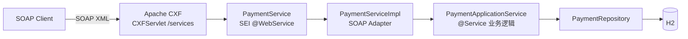

# 银行卡支付 SOAP 接口

[English](README.md) | [한국어](README.ko.md) | **简体中文** | [日本語](README.ja.md)

> 在 **Spring Boot + Apache CXF (JAX-WS)** 上复现遗留 SOAP 支付系统的
> `@WebService` SEI + `ServiceImpl` 结构的学习型 PoC

目标是亲自遇到并解决用 **SOAP 报文**（而非 REST）做对接时反复出现的问题
—— 契约（WSDL）与实现的分离、用结果码而非 Fault 表达失败、XML ↔ 对象的编组。

<br>

## 🎯 学习目标

- 在 Java First 方式下，亲眼确认 **SEI 转换成 WSDL 的过程**
- 区分 `@WebService` 中 `targetNamespace` / `serviceName` / `endpointInterface` 的作用
- 体会**将 Endpoint（适配器）与 ApplicationService（业务逻辑）分离**的理由
- 通过日志观察 JAXB 在 XML ↔ Java 对象之间编组的过程

<br>

## 🚀 功能需求

### 支付授权 (`approve`)

- 接收商户 ID、卡号、金额并完成授权。
- 授权号按 `AP` + `yyyyMMdd` + 6 位随机数的格式生成。（例：`AP20260911712509`）
- 卡号**只以掩码形式保存**。除前 6 位和后 4 位外全部遮蔽。
  - `1234567890123456` → `123456******3456`

### 交易撤销 (`cancel`)

- 用商户 ID 和授权号查找交易并撤销。
- 被撤销的交易状态从 `APPROVED` 变为 `CANCELED`，并记录撤销时间。

### 异常处理

- 以下授权请求必须抛出异常。
  - 商户 ID 为空
  - 卡号不足 15 位
  - 金额小于等于 0
- 以下撤销请求必须抛出异常。
  - 该授权号对应的交易不存在
  - 交易已被撤销
- 发生的异常**不以 SOAP Fault 抛出，而是转换为结果码**返回。
- 未预期的异常统一归为 `9999`，原因只保留在服务端日志中。

<br>

## 📄 接口规格

### Endpoint

| 项目 | 值 |
|---|---|
| targetNamespace | `http://payment.poc.com/` |
| serviceName | `PaymentService` |
| portName | `PaymentServicePort` |
| Endpoint | `http://localhost:8080/services/payment` |
| WSDL | `http://localhost:8080/services/payment?wsdl` |

### 操作

| 操作 | 请求 | 响应 |
|---|---|---|
| `approve` | `merchantId`、`cardNo`、`amount` | `resultCode`、`resultMessage`、`approvalNo`、`approvedAt` |
| `cancel` | `merchantId`、`approvalNo` | `resultCode`、`resultMessage`、`approvalNo`、`canceledAt` |

请求部件名固定为 `request`，响应部件名固定为 `response`。(`@WebParam` / `@WebResult`)

### 结果码

SOAP 响应**用结果码而非 Fault 表达失败**。（遗留报文对接的做法）

| 代码 | 含义 |
|---|---|
| `0000` | 成功 |
| `1001` | 授权请求参数错误 |
| `2001` | 撤销失败（交易不存在 / 已撤销） |
| `9999` | 系统错误 |

### 授权号

```
AP20260911712509
```

| 区段 | 示例 | 含义 |
|---|---|---|
| 前缀 | `AP` | 授权（Approval） |
| 授权日期 | `20260911` | `yyyyMMdd` |
| 流水号 | `712509` | 6 位随机数 |

授权号充当**撤销请求的键**。交易通过 `merchantId + approvalNo` 查找。

<br>

## 📐 编程要求

- 使用 Java 17、Spring Boot 3.5.11、Apache CXF 4.1.5。
- 数据库使用 H2（内存）+ Spring Data JPA。
- **`PaymentService`（SEI）是对外契约。** 该接口会原样暴露为 WSDL，
  因此不得因内部原因修改其签名。
- **不要把业务逻辑放进 `PaymentServiceImpl`。** 完成 DTO ↔ 领域对象转换后
  仅委托给 ApplicationService。
- **`PaymentApplicationService` 必须完全不知道 SOAP 的存在。**
  即使把 SOAP 换成 REST，这个类也应当可以原样复用。
- 领域对象不开放 setter，通过静态工厂方法和语义化方法改变状态。
- **提交粒度按下面的功能清单划分。**

<br>

## ✅ 功能清单

- [x] 定义领域对象 `Payment` / `PaymentStatus`
  - [x] `Payment.approve()` 静态工厂创建已授权状态
  - [x] `Payment.cancel()` —— 已撤销则抛异常
- [x] `PaymentRepository` —— 按商户 ID + 授权号查询交易
- [x] `PaymentApplicationService` 业务逻辑
  - [x] 授权请求参数校验（商户 ID / 卡号 / 金额）
  - [x] 卡号掩码
  - [x] 生成授权号
  - [x] 撤销处理
  - [ ] 授权请求幂等性（防止同一请求重复授权）
- [x] 定义 SOAP 契约
  - [x] `PaymentService` SEI (`@WebService`)
  - [x] 请求/响应 DTO (JAXB `@XmlType`)
  - [ ] 查询（inquiry）操作
- [x] `PaymentServiceImpl` SOAP 适配器
  - [x] `CardPaymentMapper` 领域对象 ↔ DTO 转换
  - [x] 异常 → 结果码转换
- [x] `CxfConfig` —— Endpoint publish + `LoggingFeature`
  - [ ] WS-Security（UsernameToken）报文头认证
- [x] 测试
  - [x] 集成测试（`JaxWsProxyFactoryBean` 客户端）
  - [x] curl 调用脚本

<br>

## 📤 运行结果

### 授权成功

**请求**

```xml
<soapenv:Envelope xmlns:soapenv="http://schemas.xmlsoap.org/soap/envelope/"
                  xmlns:pay="http://payment.poc.com/">
    <soapenv:Body>
        <pay:approve>
            <request>
                <merchantId>M1001</merchantId>
                <cardNo>1234567890123456</cardNo>
                <amount>10000</amount>
            </request>
        </pay:approve>
    </soapenv:Body>
</soapenv:Envelope>
```

**响应**

```xml
<response>
    <resultCode>0000</resultCode>
    <resultMessage>승인 성공</resultMessage>
    <approvalNo>AP20260911712509</approvalNo>
    <approvedAt>2026-09-11 05:32:04</approvedAt>
</response>
```

### 授权失败 —— 金额小于等于 0

```xml
<response>
    <resultCode>1001</resultCode>
    <resultMessage>금액은 0보다 커야 합니다</resultMessage>
</response>
```

### 撤销成功

```xml
<response>
    <resultCode>0000</resultCode>
    <resultMessage>취소 성공</resultMessage>
    <approvalNo>AP20260911712509</approvalNo>
    <canceledAt>2026-09-11 05:32:07</canceledAt>
</response>
```

### 撤销失败 —— 交易已撤销

```xml
<response>
    <resultCode>2001</resultCode>
    <resultMessage>이미 취소된 거래입니다: AP20260911712509</resultMessage>
</response>
```

### 撤销失败 —— 交易不存在

```xml
<response>
    <resultCode>2001</resultCode>
    <resultMessage>거래를 찾을 수 없습니다: AP99999999999999</resultMessage>
</response>
```

> 结果消息直接来自领域代码，因此显示为韩文。

<br>

## 🏗 架构



这是把 SOAP 契约（适配器）与业务逻辑分离的结构。

```
com.poc.payment
├── config/
│   └── CxfConfig.java               # Endpoint publish("/payment") + LoggingFeature
├── webservice/card/                 # SOAP 适配器层（对外契约）
│   ├── PaymentService.java          # SEI (@WebService) —— 原样变成 WSDL
│   ├── PaymentServiceImpl.java      # Endpoint 实现，异常 → 结果码转换
│   ├── dto/                         # SOAP 报文契约 (JAXB @XmlType)
│   └── mapper/                      # CardPaymentMapper —— 领域对象 ↔ DTO 转换
├── service/                         # PaymentApplicationService（不知道 SOAP 的一层）
├── domain/                          # Payment（状态机）、PaymentStatus
└── repository/                      # Spring Data JPA
```

由于业务层不知道 SOAP 的存在，即使把 SOAP 换成 REST，`service` 以下都可以原样复用。

<br>

## 🛠 技术栈

| 分类 | 使用技术 |
|---|---|
| Language | Java 17 |
| Framework | Spring Boot 3.5.11 |
| SOAP | Apache CXF 4.1.5 (`cxf-spring-boot-starter-jaxws`)、JAX-WS / JAXB |
| 持久化 | Spring Data JPA、H2（内存） |
| 构建 | Gradle |
| SOAP 日志 | `cxf-rt-features-logging` (`LoggingFeature`) |

<br>

## 🏃 运行方式

```bash
# 1. 运行应用
./gradlew bootRun

# 2. 查看 WSDL —— SEI 转换成契约的结果
curl http://localhost:8080/services/payment?wsdl

# 3. 调用授权
./scripts/approve.sh
```

| 分类 | 地址 |
|---|---|
| SOAP Endpoint | `http://localhost:8080/services/payment` |
| **WSDL** | `http://localhost:8080/services/payment?wsdl` |
| H2 控制台 | `http://localhost:8080/h2-console`（JDBC URL：`jdbc:h2:mem:paymentdb`，用户 `sa`，无密码） |

可以在 H2 控制台确认授权/撤销的结果。

```sql
SELECT * FROM payments;  -- 确认 status = APPROVED / CANCELED 与 masked_card_no
```

### 测试

```bash
./gradlew test
```

- `PaymentSoapIntegrationTest` —— 用 `JaxWsProxyFactoryBean` Java SOAP 客户端验证授权/撤销场景

也可以用 curl 直接发送 SOAP 报文。

```bash
./scripts/approve.sh                      # 授权
./scripts/cancel.sh AP20260911712509      # 撤销（使用授权响应中的 approvalNo）
```

**SoapUI** —— 导入 WSDL URL 后会自动生成请求模板。

> 控制台上 `LoggingFeature` 会原样输出 SOAP 请求/响应 XML，
> 因此可以亲眼确认 JAXB 的编组过程。

<br>

## 🤔 设计考量

| 主题 | 选择 | 理由 |
|---|---|---|
| WSDL 生成 | Java First (`@WebService` SEI) | 为了亲眼确认 SEI 本身变成契约的过程 |
| 失败表达 | 用结果码而非 Fault | 遗留报文对接的惯例。客户端按代码分支，而不是靠异常堆栈 |
| 分层 | Endpoint（适配器）/ ApplicationService（业务） | 即使把 SOAP 换成 REST，业务逻辑也能原样复用 |
| 报文契约 | 使用独立的 JAXB DTO 而非领域对象 | 领域字段变化不会破坏对外契约（WSDL） |
| 异常映射 | 业务层抛异常，适配器翻译成代码 | 业务层无需了解报文代码体系 |
| 卡号 | 只保存掩码后的值 | 不保留原始卡号。掩码的职责放在业务层 |
| 领域状态变更 | 静态工厂 + `cancel()` | 不开放 setter。“已撤销”的防御由领域对象负责 |

<br>

## ⚠️ 已知简化

这些是作为 PoC 范围有意保留的部分。投入实际使用前必须解决。

- **没有认证与加密** —— 既没有 WS-Security（UsernameToken）也没有 HTTPS。真实的对外接口两者都是必需的。
- **`LoggingFeature` 输出整个请求 XML** —— 它是用来观察编组过程的。明文卡号会原样留在日志里，因此生产环境不能开启。
- **授权请求没有幂等性** —— 同一请求发两次会产生两笔授权。真实系统需要基于交易唯一号的重复校验。
- **授权号是 6 位随机数** —— 同一天发生冲突会触发 unique 约束并返回 `9999`。真实系统会使用序列或发号服务。
- **Java First** —— 修改 SEI 会立刻改变 WSDL。在对外契约先行确定的场景下，Contract First 更安全。
- **H2 内存数据库** —— 重启后交易数据会消失。

<br>

## 🗺 后续计划

- [ ] 增加查询（inquiry）操作 → 观察 WSDL 的 diff
- [ ] 用 `wsdl2java` 做一版 **Contract First** 并与 Java First 对比
- [ ] 用 WSS4J 增加 SOAP 报文头认证（UsernameToken）
- [ ] 增加第二个 SEI（例如 `TossPayService`）构成多 Endpoint 结构
- [ ] 授权请求幂等性（基于交易唯一号防止重复授权）
